# AI WhatChelin? — AI Tool Recommendation & Comparison Guide

<p align="right">
  <b>🇺🇸 English</b> | <a href="README_ko.md">🇰🇷 한국어</a>
</p>

<p align="center">
  <strong>AI WhatChelin — AI Coding & Productivity Tools, What Should You Really Use?</strong><br>
  <sub>Last updated: 2026-03-27</sub>
</p>

<p align="center">
  <a href="https://chatgpt.com"></a>
  <a href="https://claude.com"></a>
  <a href="https://gemini.google.com"></a>
  <a href="https://cursor.com"></a>
  <a href="https://windsurf.com"></a>
  <a href="https://antigravity.google"></a>
  <a href="https://github.com/features/copilot"></a>
  <a href="https://code.claude.com"></a>
  <a href="https://developers.openai.com/codex/cli"></a>
  <a href="https://github.com/google-gemini/gemini-cli"></a>
  <a href="https://aider.chat"></a>
  <a href="https://kiro.dev"></a>
  <a href="https://www.trae.ai"></a>
  <a href="https://x.ai"></a>
  <a href="https://www.perplexity.ai"></a>
  <a href="https://devin.ai"></a>
  <a href="https://bolt.new"></a>
  <a href="https://v0.app"></a>
  <a href="https://lovable.dev"></a>
  <a href="https://replit.com"></a>
  <a href="https://www.tabnine.com"></a>
  <a href="https://www.midjourney.com"></a>
  <a href="https://openai.com"></a>
  <a href="https://stability.ai"></a>
  <a href="https://ideogram.ai"></a>
  <a href="https://bfl.ai"></a>
  <a href="https://firefly.adobe.com"></a>
  <a href="https://ai.google.dev"></a>
  <a href="https://openai.com/sora"></a>
  <a href="https://runwayml.com"></a>
  <a href="https://klingai.com"></a>
  <a href="https://deepmind.google/technologies/veo"></a>
  <a href="https://pika.art"></a>
  <a href="https://lumalabs.ai"></a>
  <a href="https://hailuoai.video"></a>
  <a href="https://www.microsoft.com/en-us/microsoft-365-copilot"></a>
</p>

<p align="center">
  <em>"So many tools that you spend the whole day just picking one" — A typical day for a Vibe Coder in 2026</em>
</p>

<table align="center">
<tr>
<td align="center">

**Updated automatically every morning at 5 AM**

This document is not maintained manually.
**Every day at KST 05:00**, GitHub Actions + Claude Code automatically:

`32 AI tools` · `14 official sites` · `Reddit / HN / X community` · `pricing pages`

searches for changes and reflects them immediately.
Popularity scores are recorded daily, keeping the **daily competition chart** auto-updated.


<br><br>
<a href="#-vibe-coder"></a>
<a href="#-creator"></a>
<a href="#-general-office"></a>
<br>
<a href="https://github.com/tykimos/ai-whatchelin/issues"></a>
<a href="https://github.com/tykimos/ai-whatchelin/pulls"></a>
<a href="LICENSE"></a>


</td>
</tr>
</table>

[Vibe Coder](#-vibe-coder) · [Creator](#-creator) · [General Office](#-general-office) · [Pricing Radar](#vibe-coder-pricing-radar) · [Community Comparison](#vibe-coder-community-reactions-comparison) · [Popularity Trend](#vibe-coder-popularity-trend)

---

# Vibe Coder

> AI tools for Vibe Coders who write code, build apps, and automate tasks.

<p align="center">
  <a href="https://code.claude.com"></a>
  <a href="https://cursor.com"></a>
  <a href="https://windsurf.com"></a>
  <a href="https://antigravity.google"></a>
  <a href="https://github.com/features/copilot"></a>
  <a href="https://developers.openai.com/codex/cli"></a>
  <a href="https://github.com/google-gemini/gemini-cli"></a>
  <a href="https://aider.chat"></a>
  <a href="https://kiro.dev"></a>
  <a href="https://www.trae.ai"></a>
  <a href="https://bolt.new"></a>
  <a href="https://v0.app"></a>
  <a href="https://lovable.dev"></a>
  <a href="https://replit.com"></a>
  <a href="https://www.tabnine.com"></a>
</p>

### Vibe Coder Evolution Timeline

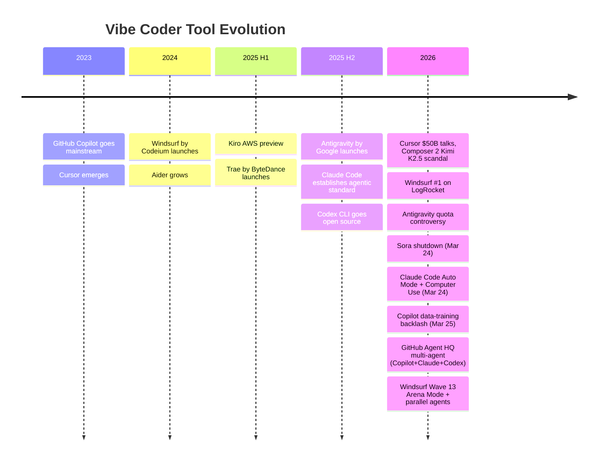

### Tool Combinations Vibe Coders Actually Use

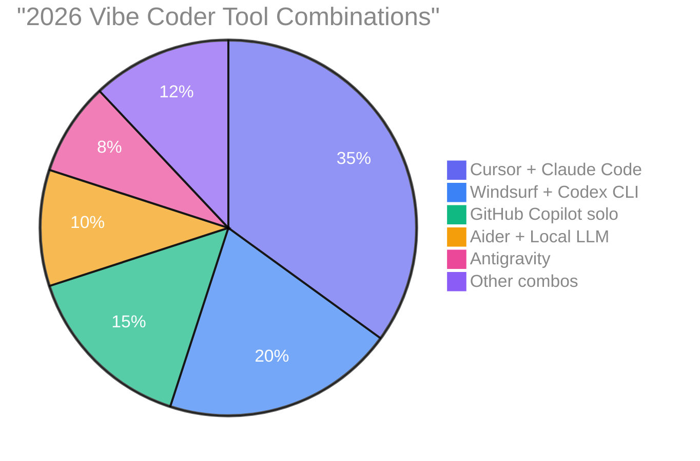

> *"Cursor is the best AI editor. Claude Code is the best AI engineer. Windsurf is the best value."*

### Which Coding Tool Is Right for Me?

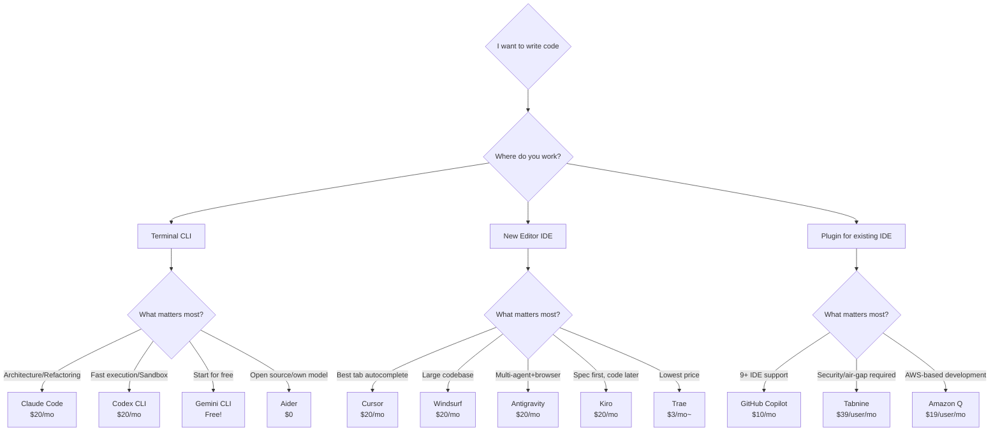

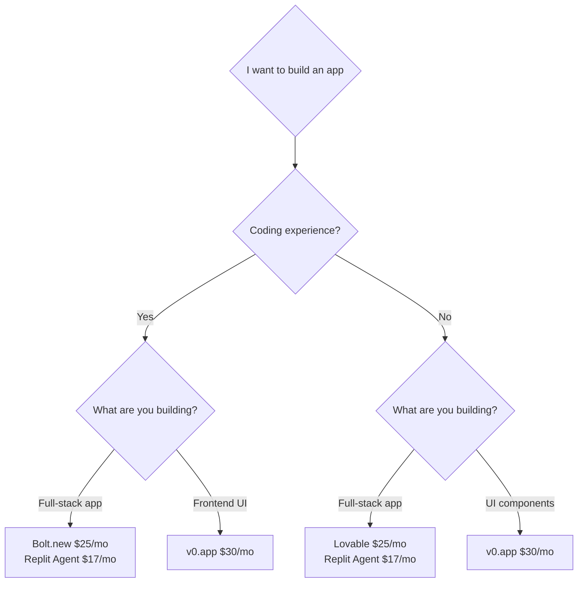

### Vibe Coder Popularity Ranking

| Rank | Tool | Category | Evidence |
|:---:|---|---|---|
| 1 | **[Claude Code](https://code.claude.com)** | Coding Agent | SWE-bench #1 (80.9%), best code quality, 67% blind test win rate |
| 2 | **[Cursor](https://cursor.com)** | AI IDE | $50B valuation talks, $2B+ ARR, best tab autocomplete |
| 3 | **[GitHub Copilot](https://github.com/features/copilot)** | AI IDE/Plugin | Most widely adopted AI dev tool, 9+ IDEs, $10/mo lowest price |
| 4 | **[Windsurf](https://windsurf.com)** | AI IDE | LogRocket 2026 #1, Cascade memory, strong on large codebases |
| 5 | **[Codex CLI](https://developers.openai.com/codex/cli)** | Coding Agent | 1M Vibe Coders in first month, safe sandbox, 240+ tok/s |

### Vibe Coder Full Map

```
Vibe Coder
├── Coding Agents (CLI)
│   ├── Claude Code ····· Anthropic, SWE-bench #1, $20/mo~
│   ├── Codex CLI ······· OpenAI, sandbox, $20/mo~
│   ├── Gemini CLI ······ Google, free 1,000 req/day
│   └── Aider ··········· open source, any LLM, $0
│
├── AI IDE
│   ├── Cursor ·········· best tab autocomplete, $0~200/mo
│   ├── Windsurf ········ Cascade memory, $0~200/mo
│   ├── Antigravity ····· Google, multi-agent, $0~250/mo
│   ├── Kiro ············ AWS, Spec-based, $0~200/mo
│   ├── Trae ············ ByteDance, lowest price, $0~100/mo
│   └── GitHub Copilot ·· 9+ IDEs, $0~39/user/mo
│
├── Code Assistants
│   ├── Amp (ex-Cody) ··· Enterprise only
│   ├── Tabnine ········· air-gap deploy, $39/user/mo~
│   └── Amazon Q ········ AWS native, $0~19/user/mo
│
├── App Builders
│   ├── Bolt.new ········ browser IDE, $0~25/mo
│   ├── v0.app ·········· Vercel integration, $0~100/user/mo
│   ├── Lovable ········· Non-coder friendly, $0~50/mo
│   └── Replit Agent ···· all-in-one deploy, $0~95/mo
│
└── Open Source
    ├── OpenClaw ········· 333K Stars, general AI
    ├── OpenCode ········· 95K Stars, terminal agent
    ├── Cline ············ 59K Stars, VS Code agent
    ├── Aider ············ 42K Stars, Git-first
    ├── Tabby ············ 33K Stars, on-premise
    ├── Continue.dev ····· 32K Stars, CI/CD integration
    └── Goose ············ 29K Stars, made by Block
```

---

## Coding Agents (CLI)

> Reads your codebase directly from the terminal and autonomously edits code. The hottest category in 2026.

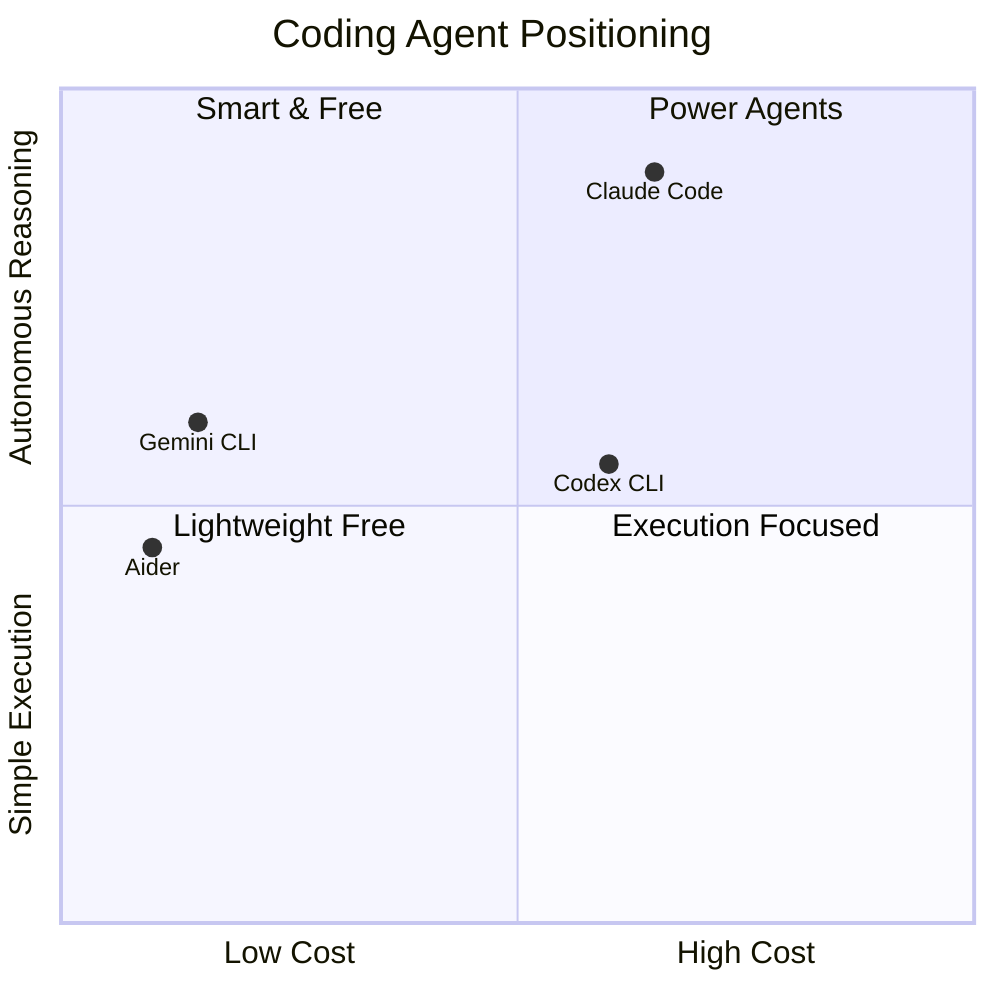

| | Claude Code | Codex CLI | Gemini CLI | Aider |
|---|---|---|---|---|
| **Site** | [code.claude.com](https://code.claude.com) | [openai.com/codex](https://developers.openai.com/codex/cli) | [gemini-cli](https://github.com/google-gemini/gemini-cli) | [aider.chat](https://aider.chat) |
| **Open Source** | X | O (Rust) | O (Apache 2.0) | O (Apache 2.0) |
| **Free** | X | X | **1,000 req/day** | **O (API cost only)** |
| **Starting Price** | $20/mo | $20/mo | $0 | $0 |
| **Model** | Anthropic only | OpenAI only | Gemini only | **Any LLM** |
| **Context** | 200K+ | GPT-5 | **1M** | per model |
| **Sandbox** | X | **O** | X | X |
| **Multi-agent** | **O** | O | X | X |
| **MCP** | **300+** | O | O | X |
| **Git** | O | partial | partial | **native** |

### What the Community Says About CLI Agents

> *"Claude Code for thinking tasks, Codex for execution tasks."* — r/ChatGPTCoding survey of 500+ Vibe Coders

> *"I've been coding all day on the $20 Plus plan and never hit a limit."* — Reddit u/LaCaipirinha (31 upvotes)

> *"One complex prompt burns 50–70% of the 5-hour limit."* — r/ChatGPTCoding (388 upvotes)

> *"Claude Code Auto Mode lets it autonomously decide permissions — a two-layer classifier checks each tool call for destructive actions before execution."* — TechCrunch `2026.03.24`

**2026 Power Stack Formula**:
```
Daily coding    = Codex CLI (keystroke level)
Commit/Arch     = Claude Code (thinking level)
Free            = Gemini CLI + Aider
```


---

## AI IDE

> AI integrated into the editor itself. From autocomplete to multi-file agents.

| | Cursor | Windsurf | Antigravity | Kiro | Trae | GH Copilot |
|---|---|---|---|---|---|---|
| **Provider** | Cursor Inc. | Cognition AI | Google DeepMind | AWS | ByteDance | GitHub |
| **Site** | [cursor.com](https://cursor.com) | [windsurf.com](https://windsurf.com) | [antigravity.google](https://antigravity.google) | [kiro.dev](https://kiro.dev) | [trae.ai](https://www.trae.ai) | [github.com](https://github.com/features/copilot) |
| **Free** | O | O | O (preview) | O (50 cr) | **O (generous)** | O (2K/mo) |
| **Starting Price** | $20/mo | $20/mo | $20/mo (AI Pro) | $20/mo | **$3/mo** | **$10/mo** |
| **Max Price** | $200/mo | $200/mo | $249.99/mo | $200/mo | $100/mo | $39/user/mo |
| **Model** | Multi | Multi+SWE-1.5 | Gemini+Claude+GPT | Claude | Claude+GPT+DeepSeek | Multi |
| **Killer Feature** | Autonomy Slider | Arena Mode + Parallel Agents | Manager View | Spec-based EARS | Lowest price | 9+ IDEs |


### Community Reactions: IDE War

> *"Cursor: charge more, give less, don't ask how it works."* — r/programming

> *"Windsurf held context better and had fewer errors on a 500K-line monorepo."* — r/ChatGPTCoding

**Antigravity Quota Controversy** (2026.03):
> *"In January I used 300M tokens/week; now I'm hitting the cap at 9M."* — Google AI for Developers forum

**Cursor Composer 2 / Kimi K2.5 Scandal** (2026.03):
> *"Cursor shipped Composer 2 as 'self-developed' but the model ID was kimi-k2p5. $50B company forgot to credit open source."* — VentureBeat `2026.03.20`

**Cursor Self-Hosted Cloud Agents** (2026.03.25):
> *"Cursor launched self-hosted cloud agents — code and tool execution stay entirely on your network. Money Forward is enabling ~1,000 engineers to create PRs from Slack."* — cursor.com/changelog `2026.03.25`

**GitHub Copilot Data Training Backlash** (2026.03.25):
> *"Starting April 24, GitHub will use Copilot Free/Pro/Pro+ interaction data to train AI models unless you opt out. 59 thumbs-down vs 3 rockets on the announcement."* — GitHub Blog `2026.03.25`

**GitHub Agent HQ Multi-Agent** (2026.03):
> *"You can now assign an issue to Copilot, Claude, Codex, or all three and compare results side by side. No additional subscription required."* — GitHub Blog `2026.03`

**Windsurf Wave 13** (2026.03):
> *"Wave 13 brings Arena Mode (blind model comparison), parallel agents via Git worktrees, and SWE-1.5 free for all users. Credits replaced with quota tiers at $20/$40/$200."* — windsurf.com/changelog `2026.03`

**Trae Privacy Warning**:
> *"Sending data to 5 ByteDance domains every 30 seconds. Continues even with telemetry disabled."* — Unit 221B security analysis


---

## Code Assistants (Plugins)

> AI tools added as plugins to your existing IDE (VS Code, JetBrains, etc.).

| | Amp (ex-Cody) | Tabnine | Amazon Q Developer |
|---|---|---|---|
| **Provider** | Sourcegraph | Tabnine | AWS |
| **Site** | [ampcode.com](https://ampcode.com) | [tabnine.com](https://www.tabnine.com) | [aws.amazon.com/q](https://aws.amazon.com/q/developer) |
| **Free** | **X (Enterprise only)** | **X (ended 2025)** | O (50 req/mo) |
| **Starting Price** | Enterprise inquiry | $39/user/mo (annual) | $19/user/mo |
| **Air-gap** | O | **O** | X |
| **Target** | Large monorepos | Finance/Medical/Defense | AWS-based teams |
| **Note** | Cody Free/Pro discontinued Jul 2025 | No free plan | Limited without Pro |

---

## App Builders

> Build and deploy apps with no coding (or minimal). The home of "vibe coding".

| | Bolt.new | v0.app | Lovable | Replit Agent |
|---|---|---|---|---|
| **Site** | [bolt.new](https://bolt.new) | [v0.app](https://v0.app) | [lovable.dev](https://lovable.dev) | [replit.com](https://replit.com) |
| **Free** | O (1M tokens) | O ($5 credits) | O (5 credits/day) | O (trial) |
| **Starting Price** | $25/mo | $30/user/mo | $25/mo | $17/mo |
| **Deploy** | Netlify | **Vercel** | built-in | **built-in+hosting** |
| **DB** | Bolt Cloud | X | Supabase | PostgreSQL |
| **Design** | Figma | Design Mode | Chat Mode | Design Canvas |
| **Collaboration** | O | O | **20 users realtime** | 15 users |


### Community Reactions: App Builders

> *"v0 for UI, Bolt for full-stack speed, Lovable for beginners who need a DB."*

> *"Fix one bug, get three new ones, and a whole month of credits gone in one debug session."* — common Lovable user complaint

**Security Warning**: All three platforms have **40–45% vulnerability rate** in generated code (NxCode 2026 analysis). A security review is mandatory regardless of which builder you use.


---

## Open Source

> Free. Your model. Your server. Your data. The land of freedom.

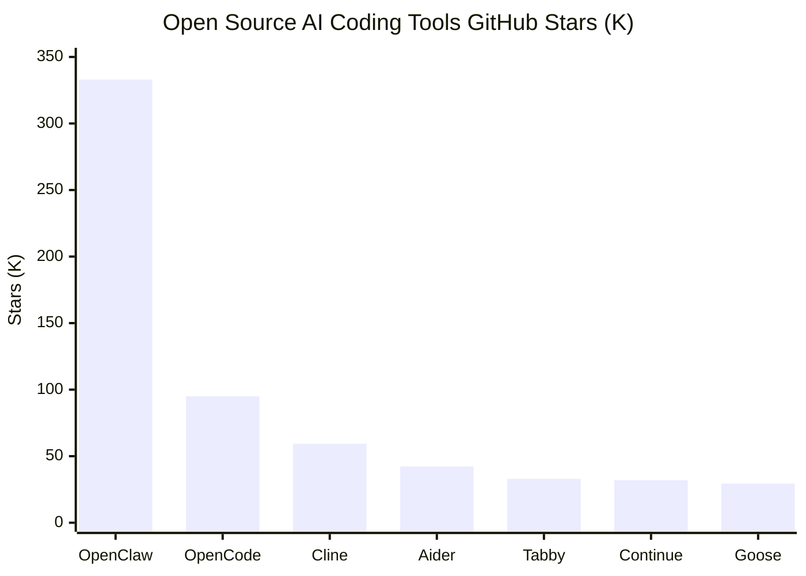

| | OpenClaw | OpenCode | Cline | Aider | Tabby | Continue | Goose |
|---|---|---|---|---|---|---|---|
| **Stars** | **333K** | 95K+ | 59.3K | 42.3K | 33K | 32K | 29.4K |
| **License** | MIT | OSS | Apache 2.0 | Apache 2.0 | — | Apache 2.0 | Apache 2.0 |
| **Type** | General AI | Terminal agent | VS Code agent | CLI agent | Code completion | IDE+CI | Autonomous agent |
| **Model** | Multi | 75+ | Multi+Ollama | **Any LLM** | Local only | Any model | Any LLM |
| **Killer Feature** | 50+ messengers, 5400 Skills | TUI, LSP, session sharing | 5M+ installs | Git-first | 0% external code transfer | CI/CD integration | Block-made, MCP |

---

## Vibe Coder Pricing Radar

| Tier | Tool | Price | Includes |
|---|---|---|---|
| **Free** | [Gemini CLI](https://github.com/google-gemini/gemini-cli) | $0 | 1,000 req/day |
| | [Aider](https://aider.chat) | $0 | API cost only |
| | [GitHub Copilot](https://github.com/features/copilot) | $0 | 2,000 completions + 50 premium/mo |
| | [Trae](https://www.trae.ai) | $0 | $3 worth + 5,000 autocomplete |
| | [Antigravity](https://antigravity.google) | $0 | preview free |
| **~$10** | [Trae Lite](https://www.trae.ai) | $3/mo | $5 worth usage |
| | [GitHub Copilot Pro](https://github.com/features/copilot) | $10/mo | unlimited autocomplete + agent |
| | [Trae Pro](https://www.trae.ai) | $10/mo | unlimited autocomplete + $20 worth |
| **$20** | [Claude Pro](https://claude.com) | $20/mo | Claude Code + Cowork included |
| | [Cursor Pro](https://cursor.com) | $20/mo | autocomplete + Cloud Agent |
| | [Windsurf Pro](https://windsurf.com) | $20/mo | Cascade + SWE-1.5 |
| | [Kiro Pro](https://kiro.dev) | $20/mo | 1,000 credits |
| | [Devin Core](https://devin.ai) | $20/mo | ACU-based agent |
| **$100+** | [Claude Max](https://claude.com) | $100~200/mo | 5x~20x Pro |
| | [Cursor Ultra](https://cursor.com) | $200/mo | 20x usage |
| | [Windsurf Max](https://windsurf.com) | $200/mo | large allocation |

### Vibe Coder Community Reactions (Comparison)

> *"Cursor makes what you already know faster. It's an accelerator. Claude Code does it for you. It's a delegator."* — Builder.io `2026.01`

> *"I've been coding all day on the $20 Plus plan and never hit a limit."* — Reddit u/LaCaipirinha `2026.01`

> *"One complex prompt burns 50–70% of the 5-hour limit."* — r/ClaudeAI (388 upvotes) `2026.02`

| Matchup | Winner (by situation) |
|---|---|
| **Claude Code vs Codex CLI** | follow plans/debug = Claude Code, no limits = Codex CLI |
| **Claude Code vs Cursor** | inline editing = Cursor, autonomous multi-file = Claude Code |
| **Cursor vs Windsurf** | large codebase = Windsurf, refactoring = Cursor |
| **Cursor vs Antigravity** | safety/production = Cursor, autonomous execution = Antigravity |
| **Windsurf vs Antigravity** | model consistency = Windsurf, free = Antigravity |
| **Gemini CLI vs Claude Code** | quality/speed = Claude Code, free = Gemini CLI |
| **GitHub Copilot vs Cursor** | everyday VSCode = Copilot, large-scale agent = Cursor |
| **Trae vs Cursor** | free prototyping = Trae, production = Cursor |
| **Bolt vs Lovable vs v0** | UI = v0, full-stack = Bolt, Non-coder = Lovable |

### Vibe Coder One-Liner Reviews

| Tool | In a word |
|---|---|
| **Cursor** | *"The best AI editor"* |
| **Claude Code** | *"The best AI engineer"* |
| **Windsurf** | *"The best value"* |
| **Codex CLI** | *"The safest executor"* |
| **Gemini CLI** | *"King of free"* |
| **Antigravity** | *"$2.4B bait-and-switch"* |
| **Trae** | *"Too good to be free... what's the catch?"* |
| **Aider** | *"The symbol of freedom"* |

### Vibe Coder Recommended Stacks

```
Senior Vibe Coder  = Cursor (daily) + Claude Code (architecture) = $40/mo
Budget Vibe Coder  = Windsurf + Gemini CLI                       = $20/mo
Open Source Fan    = Aider + Ollama                              = $0/mo
Startup MVP        = Lovable or Bolt.new                         = $25/mo
Enterprise Security= Tabnine + Amazon Q                          = $58/user/mo
```

### Vibe Coder Popularity Trend

<!-- POPULARITY_CHART_START -->
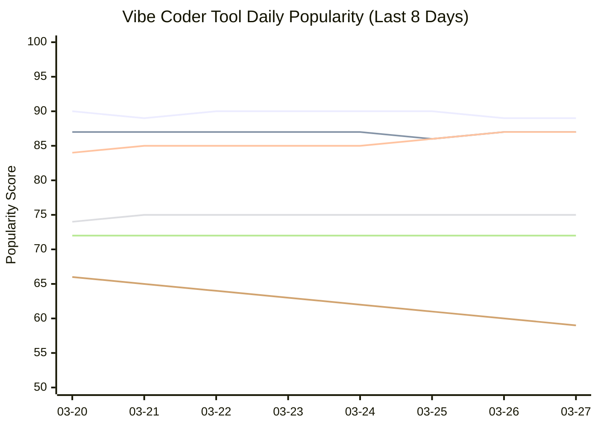
<!-- POPULARITY_CHART_END -->

<p align="center">
  
  
  
  
  
  
</p>


---

---

# Creator

> AI tools for Creators who make images and videos.

<p align="center">
  <a href="https://www.midjourney.com"></a>
  <a href="https://openai.com"></a>
  <a href="https://stability.ai"></a>
  <a href="https://ideogram.ai"></a>
  <a href="https://bfl.ai"></a>
  <a href="https://firefly.adobe.com"></a>
  <a href="https://ai.google.dev"></a>
  <a href="https://openai.com/sora"></a>
  <a href="https://runwayml.com"></a>
  <a href="https://klingai.com"></a>
  <a href="https://deepmind.google/technologies/veo"></a>
  <a href="https://pika.art"></a>
  <a href="https://lumalabs.ai"></a>
  <a href="https://hailuoai.video"></a>
</p>

### Creator Evolution Timeline

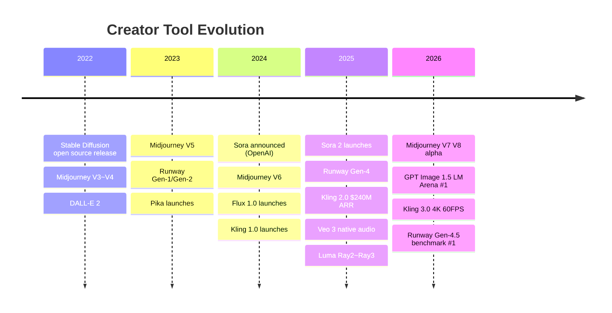

### Which Creator Tool Is Right for Me?

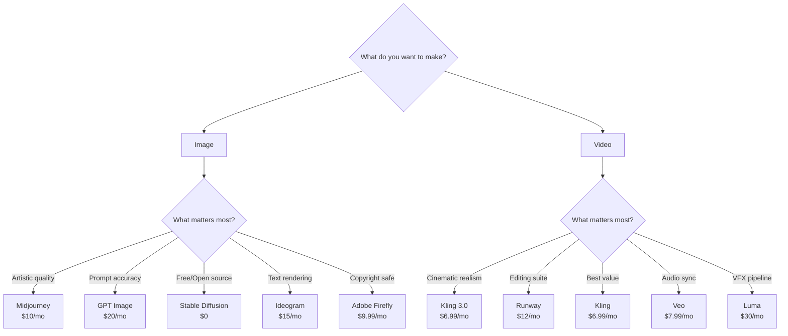

### Creator Popularity Ranking

| Rank | Image Tool | Evidence | | Rank | Video Tool | Evidence |
|:---:|---|---|---|:---:|---|---|
| 1 | **[Midjourney](https://www.midjourney.com)** | Best artistic quality, V8 alpha | | 1 | **[Runway](https://runwayml.com)** | Gen-4.5, full editing suite |
| 2 | **[GPT Image](https://openai.com)** | LM Arena #1, prompt accuracy | | 2 | ~~**[Sora](https://openai.com/sora)**~~ | ⚠️ Discontinued 2026.03.24 |
| 3 | **[Flux](https://bfl.ai)** | LM Arena #2, open source | | 3 | **[Kling](https://klingai.com)** | 3.0, $6.99 value, 4K 60FPS |
| 4 | **[Ideogram](https://ideogram.ai)** | #1 text rendering | | 4 | **[Veo](https://deepmind.google)** | 3.1, native audio |
| 5 | **[Adobe Firefly](https://firefly.adobe.com)** | Copyright safe | | 5 | **[Luma](https://lumalabs.ai)** | Ray3.14, 4K EXR |

### Creator Full Map

```
Creator
├── AI Image Generation
│   ├── Midjourney ······ best artistic quality, $10/mo~
│   ├── GPT Image ······· #1 prompt accuracy, $20/mo~
│   ├── Stable Diffusion · open source, free self-hosting
│   ├── Ideogram ········ best text rendering, $15/mo~
│   ├── Flux ············ photorealism, $0.04/image
│   ├── Adobe Firefly ··· copyright safe, $9.99/mo~
│   └── Google Imagen ··· Google ecosystem, free (AI Studio)
│
└── AI Video Generation
    ├── ~~Sora~~ ········· ⚠️ discontinued 2026.03.24
    ├── Runway ··········· full editing suite, $12/mo~
    ├── Kling ············ human realism + value, $6.99/mo~
    ├── Veo ·············· native audio, $7.99/mo~
    ├── Pika ············· physics effect presets, $10/mo~
    ├── Luma ············· VFX pipeline, $30/mo~
    └── HailuoAI ········· bulk production value, $14.99/mo~
```

---

## AI Image Generation

> Create images from text. Pro-level visuals without a designer.

| | Midjourney | GPT Image | Stable Diffusion | Ideogram | Flux | Adobe Firefly | Google Imagen |
|---|---|---|---|---|---|---|---|
| **Site** | [midjourney.com](https://www.midjourney.com) | [openai.com](https://openai.com) | [stability.ai](https://stability.ai) | [ideogram.ai](https://ideogram.ai) | [bfl.ai](https://bfl.ai) | [firefly.adobe.com](https://firefly.adobe.com) | [ai.google.dev](https://ai.google.dev) |
| **Latest Model** | V7 (V8 alpha) | GPT Image 1.5 | SD 3.5 Large | Ideogram 3.0 | FLUX.1.1 Pro | Firefly 2026 | Imagen 4 Ultra |
| **Free** | X | ChatGPT included | **O (self-hosting)** | O (limited) | O (Schnell, Apache 2.0) | X | **O (AI Studio)** |
| **Starting Price** | $10/mo | $20/mo (Plus) | $0 (self-hosting) | $15/mo | $0.04/image | $9.99/mo | $0.02/image |
| **Killer Feature** | Best artistic quality | #1 prompt accuracy | open source, custom training | **best text rendering** | photorealism | copyright safe, Adobe integration | Google ecosystem, SynthID |
| **Target** | Creators, artists | ChatGPT users | tech users, custom | designers, typography | Vibe Coders, API | enterprises, brands | Google users |

---

## AI Video Generation

> Create videos from text/images. The fastest-growing AI category in 2026.

| | ~~Sora~~ | Runway | Kling | Veo | Pika | Luma | HailuoAI |
|---|---|---|---|---|---|---|---|
| **Site** | ~~[openai.com/sora](https://openai.com/sora)~~ | [runwayml.com](https://runwayml.com) | [klingai.com](https://klingai.com) | [deepmind.google](https://deepmind.google/technologies/veo) | [pika.art](https://pika.art) | [lumalabs.ai](https://lumalabs.ai) | [hailuoai.video](https://hailuoai.video) |
| **Latest Model** | **⚠️ Discontinued 2026.03.24** | Gen-4.5 | Kling 3.0 | Veo 3.1 | Pika 2.5 | Ray3.14 | Hailuo 2.3 |
| **Free** | — | O (125 credits) | **O (66 credits/day)** | O ($7.99) | O (80/mo) | O (limited) | X |
| **Starting Price** | — | **$12/mo** | **$6.99/mo** | $7.99/mo | **$10/mo** | $30/mo | $14.99/mo |
| **Resolution** | — | 4K | **4K, 60FPS** | 1080p | — | **4K EXR** | — |
| **Audio** | — | X | **O (sync)** | **O (native)** | O (auto) | X | X |
| **Killer Feature** | ~~cinematic realism~~ | full editing suite | best human realism | audio-video sync | physics effect presets | VFX pipeline, ACES | best bulk value |
| **Target** | — | pro creators | Vibe Coders, budget | Google users | social creators | VFX artists | bulk production |


### Community Reactions: Image/Video AI

> *"Midjourney is still the king of artistic quality. DALL-E is the king of accuracy. Stable Diffusion is the king of freedom."*

> *"How does Kling 3.0 give this quality for $6.99? Sora costs $20."* `2026.02`

> *"Runway Gen-4.5 is not a tool, it's a studio. It's on a different level from other generation-only tools."* `2026.03`

> *"Veo 3.1's native audio sync is a game changer. No separate audio work needed."* `2026.03`


## Creator Open Source

> Free. Your model. Your server. Your data. The land of freedom.

| | Stable Diffusion | ComfyUI | Flux Schnell |
|---|---|---|---|
| **Stars** | — | 70K+ | — |
| **License** | Community | GPL 3.0 | Apache 2.0 |
| **Type** | Image generation | Workflow UI | Image generation |
| **Killer Feature** | fully local, LoRA/ControlNet | node-based workflow | commercial-free Apache 2.0 |

---

## Creator Pricing Radar

| Tier | Tool | Price | Includes |
|---|---|---|---|
| **Free** | [Stable Diffusion](https://stability.ai) | $0 | self-hosting |
| | [Google Imagen](https://ai.google.dev) | $0 | AI Studio |
| | [Kling](https://klingai.com) | $0 | 66 credits/day |
| | [Pika](https://pika.art) | $0 | 80/mo |
| **~$10** | [Adobe Firefly](https://firefly.adobe.com) | $9.99/mo | 2,000 credits |
| | [Midjourney](https://www.midjourney.com) | $10/mo | ~3.3 GPU hours |
| | [Pika Standard](https://pika.art) | $10/mo | 700 credits |
| **~$20** | [Runway Standard](https://runwayml.com) | $12/mo | 625 credits |
| | [HailuoAI](https://hailuoai.video) | $14.99/mo | 1,000 credits |
| | [Ideogram Plus](https://ideogram.ai) | $15/mo | — |
| | ~~[Sora](https://openai.com/sora)~~ | ~~$20/mo~~ | ⚠️ Discontinued 2026.03.24 |
| **$30+** | [Luma](https://lumalabs.ai) | $30/mo | Ray3.14 |
| | [Midjourney Pro](https://www.midjourney.com) | $60/mo | ~30 GPU hours |

### Creator Community Reactions

> *"Midjourney is still the king of artistic quality. DALL-E is the king of accuracy. Stable Diffusion is the king of freedom."*

> *"How does Kling 3.0 give this quality for $6.99? Sora costs $20."* `2026.02`

> *"Runway Gen-4.5 is not a tool, it's a studio. It's on a different level from other generation-only tools."* `2026.03`

> *"Veo 3.1's native audio sync is a game changer. No separate audio work needed."* `2026.03`

### Creator One-Liner Reviews

| Tool | In a word |
|---|---|
| **Midjourney** | *"King of artistic quality"* |
| **GPT Image** | *"#1 prompt accuracy"* |
| **Stable Diffusion** | *"King of freedom (open source)"* |
| **Ideogram** | *"For text, use this"* |
| ~~**Sora**~~ | *"⚠️ Discontinued 2026.03.24"* |
| **Runway** | *"Not a tool, a studio"* |
| **Kling** | *"The $6.99 miracle"* |
| **Veo** | *"Audio and video in one shot"* |

### Creator Recommended Stacks

```
Poster design      = Midjourney + Ideogram        = $25/mo
Short-form video   = Kling + Pika                 = $17/mo~
Film-grade prod.   = Runway + Luma                = $42/mo
Open source fan    = Stable Diffusion + ComfyUI   = $0/mo
```


---

---

# General Office

> AI tools for office workers who ask questions, search, organize documents, and automate tasks.

<p align="center">
  <a href="https://chatgpt.com"></a>
  <a href="https://claude.com"></a>
  <a href="https://gemini.google.com"></a>
  <a href="https://www.microsoft.com/en-us/microsoft-365-copilot"></a>
  <a href="https://x.ai"></a>
  <a href="https://www.perplexity.ai"></a>
  <a href="https://claude.com"></a>
  <a href="https://devin.ai"></a>
</p>

### General Office Evolution Timeline

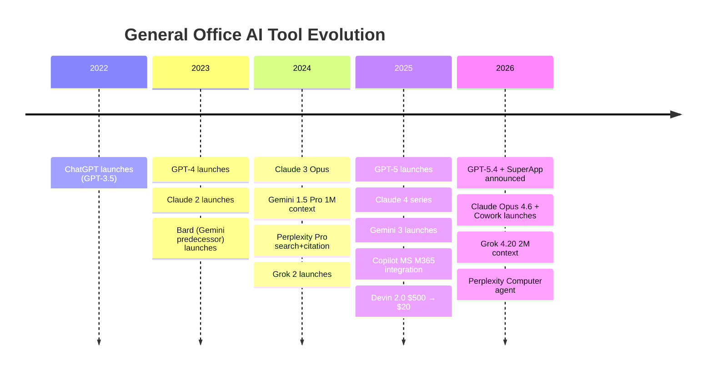

### Which General Office Tool Is Right for Me?

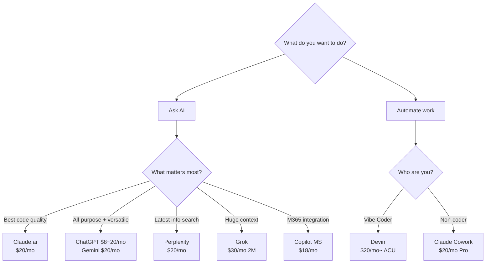

### General Office Popularity Ranking

| Rank | Tool | Evidence |
|:---:|---|---|
| 1 | **[ChatGPT](https://chatgpt.com)** | 900M weekly users, 50M paid, SuperApp announced |
| 2 | **[Claude.ai](https://claude.com)** | 1M context, Extended Thinking, #1 coding quality |
| 3 | **[Gemini](https://gemini.google.com)** | market share surge 5.4%→18.2%, video/image generation |
| 4 | **[Perplexity](https://www.perplexity.ai)** | unique search+citation integration, Computer agent |
| 5 | **[Grok](https://x.ai)** | 2M context (industry max), X real-time data |

### General Office Full Map

```
General Office
├── Chat AI
│   ├── ChatGPT ········· OpenAI, GPT-5.4, $0~200/mo
│   ├── Claude.ai ······· Anthropic, Opus 4.6, $0~200/mo
│   ├── Gemini ·········· Google, 3.1 Pro, $0~250/mo
│   ├── Copilot (MS) ···· Microsoft, M365 integration, $0~30/mo
│   ├── Grok ············ xAI, 2M context, $0~30/mo
│   └── Perplexity ······ search+citation, $0~325/mo
│
└── Autonomous Agents
    ├── Claude Cowork ··· Non-coder tasks, $20/mo~
    └── Devin ··········· autonomous coding, $20/mo~
```

---

## Chat AI

> Chat via web/app to ask questions, generate code, debug. The most accessible AI tools.

| | ChatGPT | Claude.ai | Gemini | Copilot (MS) | Grok | Perplexity |
|---|---|---|---|---|---|---|
| **Provider** | OpenAI | Anthropic | Google | Microsoft | xAI | Perplexity AI |
| **Site** | [chatgpt.com](https://chatgpt.com) | [claude.com](https://claude.com) | [gemini.google.com](https://gemini.google.com) | [microsoft.com](https://www.microsoft.com/en-us/microsoft-365-copilot) | [x.ai](https://x.ai) | [perplexity.ai](https://www.perplexity.ai) |
| **Latest Model** | GPT-5.4 | Claude Opus 4.6 | Gemini 3.1 Pro | GPT-5.4 + Claude | Grok 4.20 | Sonar Pro |
| **Free** | O | O | O | O | O | O |
| **Starting Price** | $8/mo (Go) | $20/mo (Pro) | $19.99/mo | $18/mo | $30/mo | $20/mo |
| **Max Price** | $200/mo (Pro) | $200/mo (Max) | $249.99/mo (Ultra) | $30/mo | $30/mo | $325/seat/mo |
| **Context** | 128K | **1M** | 1M | — | **2M** | per model |
| **Killer Feature** | Canvas + Codex | Extended Thinking | video/image gen | M365 integration | X real-time data | search+citation |

> *"ChatGPT is the Swiss Army knife, Claude is the artisan's scalpel, Gemini is the key to the Google ecosystem"*

---

## Autonomous Agents

> Say "do this" and it researches, plans, executes, and verifies on its own. The most futuristic category.

| | Claude Cowork | Devin |
|---|---|---|
| **Site** | [claude.com](https://claude.com) | [devin.ai](https://devin.ai) |
| **Target** | Non-coder office workers | Software engineers |
| **Environment** | Desktop app | Cloud IDE |
| **Starting Price** | $20/mo (Pro) | $20/mo (Core, ACU-based) |
| **Integrations** | Drive, Gmail, Slack, DocuSign | GitHub, custom IDE |
| **Billing** | Subscription | ACU ($2.25/unit, ~15 min) |


### Community Reactions: Autonomous Agents

**Claude Cowork:**
> *"I asked it to organize things and it deleted 11GB of files it judged as 'useless'."* — real user experience

> *"A junior with zero AI experience was using it within 45 minutes, and by day two was delegating complex tasks."* — Hackceleration 6-week test

**Devin:**
> *"The $500/mo Team tier only makes sense if you have a large, well-defined backlog. For vague tasks, Claude Code at $20/mo wins."* — Reddit consensus


## General Office Open Source

> Free. Your model. Your server. Your data. The land of freedom.

| | OpenClaw | LM Studio | Jan.ai |
|---|---|---|---|
| **Stars** | 333K | — | 25K+ |
| **License** | MIT | Free (non-open source) | AGPL 3.0 |
| **Type** | General AI assistant | Local LLM runner | Local AI chat |
| **Killer Feature** | 50+ messenger integrations | GPU auto-detect, one-click | fully offline support |

---

## General Office Pricing Radar

| Tier | Tool | Price | Includes |
|---|---|---|---|
| **Free** | [ChatGPT](https://chatgpt.com) | $0 | GPT-5 mini |
| | [Claude.ai](https://claude.com) | $0 | Sonnet 4.5 |
| | [Gemini](https://gemini.google.com) | $0 | 100 AI credits |
| | [Perplexity](https://www.perplexity.ai) | $0 | limited |
| **~$20** | [ChatGPT Go](https://chatgpt.com) | $8/mo | GPT-5.3 Instant |
| | [Copilot MS](https://www.microsoft.com/en-us/microsoft-365-copilot) | $18/mo | M365 integration |
| | [ChatGPT Plus](https://chatgpt.com) | $20/mo | GPT-5.2 + Codex |
| | [Claude Pro](https://claude.com) | $20/mo | Opus 4.6 + Cowork |
| | [Gemini Pro](https://gemini.google.com) | $19.99/mo | Gemini 3 |
| | [Perplexity Pro](https://www.perplexity.ai) | $20/mo | unlimited Pro |
| | [Devin Core](https://devin.ai) | $20/mo | ACU-based |
| **$30+** | [Grok](https://x.ai) | $30/mo | 2M context |
| | [ChatGPT Pro](https://chatgpt.com) | $200/mo | GPT-5.4 Pro |
| | [Claude Max](https://claude.com) | $100~200/mo | 5x~20x |
| | [Gemini Ultra](https://gemini.google.com) | $249.99/mo | all features |

### General Office Community Reactions (Comparison)

> *"Claude dominates GPT4 in Python."* — r/programming `2026.01`

> *"Switched to Claude yesterday and it built my entire phone app. It actually listens."* — r/programming `2026.02`

> *"I asked it to organize things and it deleted 11GB of files it judged as 'useless'."* — Claude Cowork user `2026.01`

| Matchup | Winner (by situation) |
|---|---|
| **ChatGPT vs Claude (coding)** | code quality = Claude (78%), general use = ChatGPT |
| **Devin vs Claude Code** | autonomous delegation = Devin, interactive debug = Claude Code |

### General Office One-Liner Reviews

| Tool | In a word |
|---|---|
| **ChatGPT** | *"The Swiss Army knife"* |
| **Claude.ai** | *"The artisan's scalpel"* |
| **Gemini** | *"The key to the Google ecosystem"* |
| **Perplexity** | *"The only search+citation combo"* |
| **Grok** | *"The 2M context monster"* |
| **Devin** | *"Expensive but truly autonomous"* |
| **Claude Cowork** | *"Claude Code for Non-coders"* |

### General Office Recommended Stacks

```
Office worker  = ChatGPT + Claude Cowork         = $40/mo
Researcher     = Perplexity + Grok               = $50/mo
M365 user      = Copilot MS                      = $18/mo
```


---

## Contributing

The AI tools market changes every week. If information is outdated or a new tool has appeared:

- **[Send a PR](https://github.com/tykimos/ai-whatchelin/pulls)** — price updates, new tools, error fixes
- **[Open an Issue](https://github.com/tykimos/ai-whatchelin/issues)** — "This is wrong", "This tool is missing"
- **Star this repo** — help more Vibe Coders find it

---


### Fact Check Log (2026-03-27)

All pricing information has been directly verified from each service's official website.

| Tool | Verification URL | Key Changes |
|---|---|---|
| ChatGPT | chatgpt.com/pricing | Go plan $8/mo newly added |
| Claude | claude.com/pricing | Max plan confirmed ($100~$200/mo) |
| Cursor | cursor.com/pricing | Pro+ $60/mo confirmed, Bugbot separate |
| Windsurf | windsurf.com/pricing | Max $200/mo confirmed |
| Kiro | kiro.dev/pricing | 500 bonus credits (30 days) |
| GitHub Copilot | github.com/features/copilot/plans | Pro Plus new, Opus 4.6 in Enterprise |
| Devin | devin.ai/pricing | ACU-based billing confirmed |
| Bolt | bolt.new/pricing | token rollover from Jul 2025 |
| v0 | v0.app/pricing | domain changed v0.dev → v0.app |
| Lovable | lovable.dev/pricing | 50% student discount, Q1 Cloud $25 included |
| Tabnine | tabnine.com/pricing | annual subscription only, free plan discontinued |
| Sourcegraph | sourcegraph.com | Cody Free/Pro discontinued Jul 2025, moved to Amp |
| Trae | docs.trae.ai | 5 tiers: Free/$3/$10/$30/$100 |
| Antigravity | antigravity.google | part of Google AI Pro/Ultra subscription |


---

## Star History

<p align="center">
  <a href="https://star-history.com/#tykimos/ai-whatchelin&Date">
    <picture>
      <source media="(prefers-color-scheme: dark)" srcset="https://api.star-history.com/svg?repos=tykimos/ai-whatchelin&type=Date&theme=dark&v=20260325">
      
    </picture>
  </a>
</p>

---

## Activity

<p align="center">
  
  
  
  
  
</p>

---

## 2026 Company Release Timeline

> Every major AI announcement in 2026, fact-checked with official sources.

### Anthropic (Claude)

> 2026 has been insane for Anthropic.

| Date | Release | Source |
|---|---|---|
| 2026/03/25 | **5th Economic Index** (6-month users 10% higher success) | [anthropic.com](https://www.anthropic.com/research/the-economic-index-5) |
| 2026/03/24 | Claude Code **Auto Mode** + **Computer Use** for Cowork + **Channels** (Discord/Telegram) | [techcrunch.com](https://techcrunch.com/2026/03/24/anthropic-hands-claude-code-more-control-but-keeps-it-on-a-leash/) |
| 2026/03/24 | Claude Code surpasses **$2.5B ARR** | [cnbc.com](https://www.cnbc.com/2026/03/24/anthropic-claude-ai-agent-use-computer-finish-tasks.html) |
| 2026/03/20 | Projects in Cowork + Claude Code Channels (Discord/Telegram) | [venturebeat.com](https://venturebeat.com/orchestration/anthropic-just-shipped-an-openclaw-killer-called-claude-code-channels) |
| 2026/03/17 | Dispatch (persistent agent thread) | [mlq.ai](https://mlq.ai/news/anthropic-launches-claude-dispatch-for-remote-desktop-ai-control/) |
| 2026/03/13 | **1M context window GA** (no premium) | [claude.com](https://claude.com/blog/1m-context-ga) |
| 2026/03/12 | Charts/diagrams in chat + $100M Partner Network | [anthropic.com](https://www.anthropic.com/news/claude-partner-network) |
| 2026/03/11 | Excel & PowerPoint cross-app update + Anthropic Institute | [anthropic.com](https://www.anthropic.com/news/the-anthropic-institute) |
| 2026/03/09 | Claude Code Review (multi-agent PR review) | [techcrunch.com](https://techcrunch.com/2026/03/09/anthropic-launches-code-review-tool-to-check-flood-of-ai-generated-code/) |
| 2026/03/07 | Claude Community Ambassadors | [claude.com](https://claude.com/community/ambassadors) |
| 2026/03/06 | Claude Marketplace + Mozilla Firefox Security Partnership | [siliconangle.com](https://siliconangle.com/2026/03/06/anthropic-launches-claude-marketplace-third-party-cloud-services/) |
| 2026/03/02 | Claude Memory (free tier) + ChatGPT import | [engadget.com](https://www.engadget.com/ai/anthropic-brings-memory-to-claudes-free-plan-220729070.html) |
| 2026/02/25 | Claude Code Remote Control + Cowork Scheduled Tasks + Vercept acquisition | [venturebeat.com](https://venturebeat.com/orchestration/anthropic-just-released-a-mobile-version-of-claude-code-called-remote) |
| 2026/02/24 | Cowork Enterprise + Plugin Marketplace | [techcrunch.com](https://techcrunch.com/2026/02/24/anthropic-launches-new-push-for-enterprise-agents-with-plugins-for-finance-engineering-and-design/) |
| 2026/02/20 | Claude Code Security (500+ vulns found) | [anthropic.com](https://www.anthropic.com/news/claude-code-security) |
| 2026/02/17 | **Sonnet 4.6** | [anthropic.com](https://www.anthropic.com/news/claude-sonnet-4-6) |
| 2026/02/12 | **$30B Series G** ($380B valuation) | [anthropic.com](https://www.anthropic.com/news/anthropic-raises-30-billion-series-g-funding-380-billion-post-money-valuation) |
| 2026/02/10 | Cowork for Windows | [venturebeat.com](https://venturebeat.com/technology/anthropics-claude-cowork-finally-lands-on-windows-and-it-wants-to-automate) |
| 2026/02/07 | Fast Mode (2.5x faster Opus 4.6) | [platform.claude.com](https://platform.claude.com/docs/en/release-notes/overview) |
| 2026/02/05 | **Opus 4.6** + Claude in PowerPoint + Excel update + Compaction API | [anthropic.com](https://www.anthropic.com/news/claude-opus-4-6) |
| 2026/01/30 | Cowork Plugins (11 open-source) | [siliconangle.com](https://siliconangle.com/2026/01/30/anthropic-debuts-claude-cowork-plugins-help-users-automate-tasks/) |
| 2026/01/22 | Claude's New Constitution | [anthropic.com](https://www.anthropic.com/news/claude-new-constitution) |
| 2026/01/13 | Anthropic Labs (research incubator) | [anthropic.com](https://www.anthropic.com/news/introducing-anthropic-labs) |
| 2026/01/12 | Claude Cowork (Mac research preview) | [anthropic.com](https://www.anthropic.com/news) |

### OpenAI

| Date | Release | Source |
|---|---|---|
| 2026/03/26 | Legacy deep research mode removed | [help.openai.com](https://help.openai.com/en/articles/6825453-chatgpt-release-notes) |
| 2026/03/24 | **Sora shutdown** (app + API discontinued) | [axios.com](https://www.axios.com/2026/03/24/openai-discontinue-sora-video-app) |
| 2026/03/20 | Codex for Students ($100 credits) | [help.openai.com](https://help.openai.com/en/articles/6825453-chatgpt-release-notes) |
| 2026/03/20 | **SuperApp announced** (ChatGPT + Codex + Atlas browser) | [bloomberg.com](https://www.bloomberg.com/news/articles/2026-03-20/openai-plans-desktop-app-combining-chat-coding-and-web-browsing) |
| 2026/03/18 | GPT-5.4 mini rollout | [help.openai.com](https://help.openai.com/en/articles/9624314-model-release-notes) |
| 2026/03/17 | Simplified model picker (Instant/Thinking/Pro) | [help.openai.com](https://help.openai.com/en/articles/6825453-chatgpt-release-notes) |
| 2026/03/05 | **GPT-5.4** (Thinking + Pro, computer use, 1M context) | [openai.com](https://openai.com/index/introducing-gpt-5-4/) |
| 2026/03/03 | GPT-5.3 Instant (less "cringe") | [openai.com](https://openai.com/index/gpt-5-3-instant/) |
| 2026/02/12 | GPT-5.3-Codex-Spark (1,000+ tok/s, Cerebras) | [openai.com](https://openai.com/index/introducing-gpt-5-3-codex-spark/) |
| 2026/02/05 | **GPT-5.3-Codex** (25% faster, self-bootstrapped) | [openai.com](https://openai.com/index/introducing-gpt-5-3-codex/) |
| 2026/01/16 | **ChatGPT Go** ($8/mo, 170+ countries) | [openai.com](https://openai.com/index/introducing-chatgpt-go/) |
| 2026/01/14 | GPT-5.2-Codex (agentic coding) | [openai.com](https://openai.com/index/introducing-gpt-5-2-codex/) |

### Google (DeepMind)

| Date | Release | Source |
|---|---|---|
| 2026/03/17 | **Gemini 3 Flash** (new default model) | [blog.google](https://blog.google/products/gemini/gemini-3-flash/) |
| 2026/03/11 | Gemini CLI Plan Mode GA + **Antigravity quota controversy** | [developers.googleblog.com](https://developers.googleblog.com/plan-mode-now-available-in-gemini-cli/) |
| 2026/03/03 | **Gemini 3.1 Flash-Lite** (1/8 cost of Pro) | [blog.google](https://blog.google/innovation-and-ai/models-and-research/gemini-models/gemini-3-1-flash-lite/) |
| 2026/02/19 | **Gemini 3.1 Pro** | [deepmind.google](https://deepmind.google/models/model-cards/gemini-3-1-pro/) |
| 2026/02/17 | **Imagen 4** family GA + Imagen 4 Fast | [developers.googleblog.com](https://developers.googleblog.com/announcing-imagen-4-fast-and-imagen-4-family-generally-available-in-the-gemini-api/) |
| 2026/02/12 | Gemini 3 Deep Think (science/engineering) | [blog.google](https://blog.google/innovation-and-ai/models-and-research/gemini-models/gemini-3-deep-think/) |
| 2026/01/27 | Google AI Plus ($7.99/mo) expands to 35 countries | [blog.google](https://blog.google/products-and-platforms/products/google-one/google-ai-plus-availability/) |
| 2026/01/13 | Veo 3.1 update (vertical video, 4K, audio) | [blog.google](https://blog.google/innovation-and-ai/technology/ai/veo-3-1-ingredients-to-video/) |
| 2026/01/05 | Boston Dynamics + DeepMind robotics partnership | [bostondynamics.com](https://bostondynamics.com/blog/boston-dynamics-google-deepmind-form-new-ai-partnership/) |

### Microsoft

| Date | Release | Source |
|---|---|---|
| 2026/03/25 | **Copilot data training policy** (opt-out by Apr 24) + Copilot for Jira enhancements | [github.blog](https://github.blog/news-insights/company-news/updates-to-github-copilot-interaction-data-usage-policy/) |
| 2026/03/11 | GitHub Copilot JetBrains: custom agents, sub-agents, plan agent GA | [github.blog](https://github.blog/changelog/2026-03-11-major-agentic-capabilities-improvements-in-github-copilot-for-jetbrains-ides/) |
| 2026/03/09 | **Copilot Cowork** (with Anthropic) + **Agent 365** + **M365 E7** ($99/user/mo) | [microsoft.com](https://www.microsoft.com/en-us/microsoft-365/blog/2026/03/09/powering-frontier-transformation-with-copilot-and-agents/) |
| 2026/02/~ | M365 Copilot: Smart scheduling, visual recaps, agents in OneDrive | [techcommunity.microsoft.com](https://techcommunity.microsoft.com/blog/microsoft365copilotblog/what%E2%80%99s-new-in-microsoft-365-copilot--february-2026/4496489) |
| 2026/01/~ | M365 Copilot: Agent mode in Excel, voice memory, Outlook mobile | [techcommunity.microsoft.com](https://techcommunity.microsoft.com/blog/microsoft365copilotblog/what%E2%80%99s-new-in-microsoft-365-copilot--january-2026/4488916) |

### Cursor

| Date | Release | Source |
|---|---|---|
| 2026/03/25 | **Self-hosted cloud agents** (Brex, Money Forward, Notion) | [cursor.com](https://cursor.com/blog/self-hosted-cloud-agents) |
| 2026/03/19 | **Composer 2** model (Kimi K2.5 based) + **Cursor Glass** alpha | [cursor.com](https://cursor.com/blog/composer-2) |
| 2026/03/12 | **$50B valuation** talks (Bloomberg) | [bloomberg.com](https://www.bloomberg.com/news/articles/2026-03-12/ai-coding-startup-cursor-in-talks-for-about-50-billion-valuation) |
| 2026/03/02 | Surpassed **$2B ARR** | [techcrunch.com](https://techcrunch.com/2026/03/02/cursor-has-reportedly-surpassed-2b-in-annualized-revenue/) |

### xAI (Grok)

| Date | Release | Source |
|---|---|---|
| 2026/03/10 | **Grok 4.20** (2M context, multi-agent) | [docs.x.ai](https://docs.x.ai/developers/release-notes) |
| 2026/01/28 | Grok Imagine API (video + image generation) | [x.ai](https://x.ai/news/grok-imagine-api) |

### Midjourney

| Date | Release | Source |
|---|---|---|
| 2026/03/17 | **V8 Alpha** (5x faster, 2K native, text rendering) | [updates.midjourney.com](https://updates.midjourney.com/v8-alpha/) |
| 2026/01/09 | Niji 7 (anime model) | [updates.midjourney.com](https://updates.midjourney.com/niji-v7/) |

### Runway

| Date | Release | Source |
|---|---|---|
| 2025/12/01 | Gen-4.5 (current top model, Elo #1) | [runwayml.com](https://runwayml.com/research/introducing-runway-gen-4.5) |

---

## Contributors

<p align="center">
  <a href="https://github.com/tykimos/ai-whatchelin/graphs/contributors">
    
  </a>
</p>

<p align="center">
  <em>Thank you to all our contributors!</em>
</p>

---

<p align="center">
  
  
  
  
</p>

<p align="center">
  <em>This document is based on official site fact checks + real community user reactions.</em><br>
  <em>Prices and features change frequently. Always check the official site before subscribing.</em>
</p>
