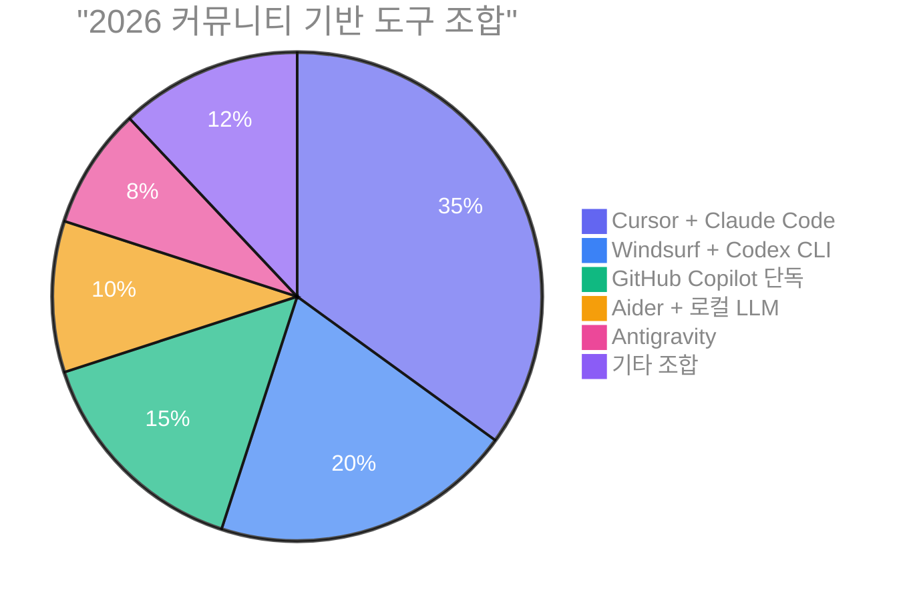
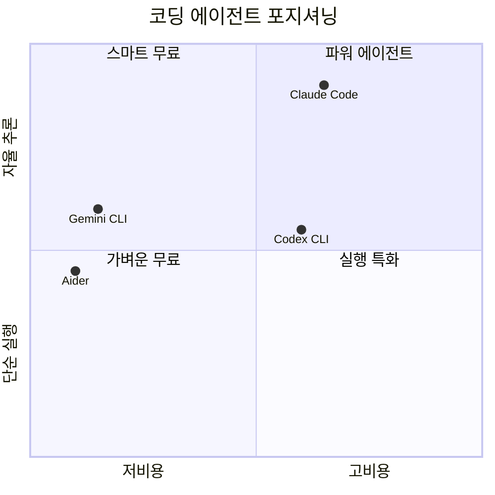
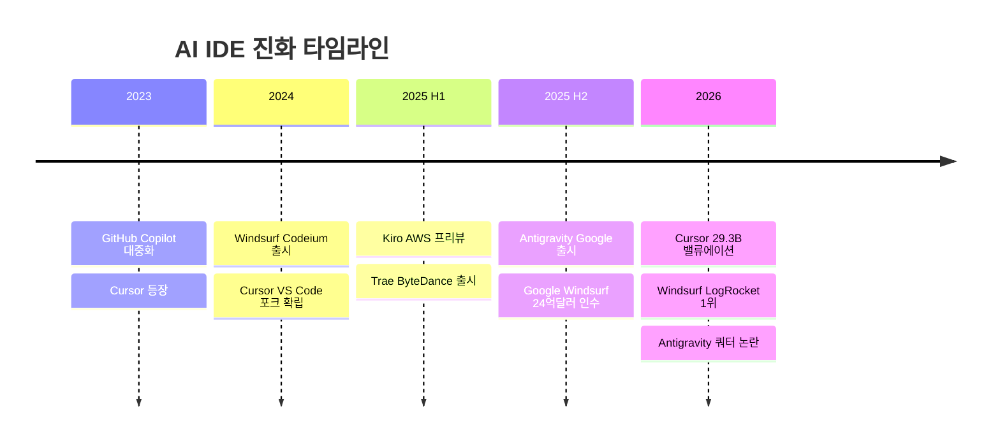
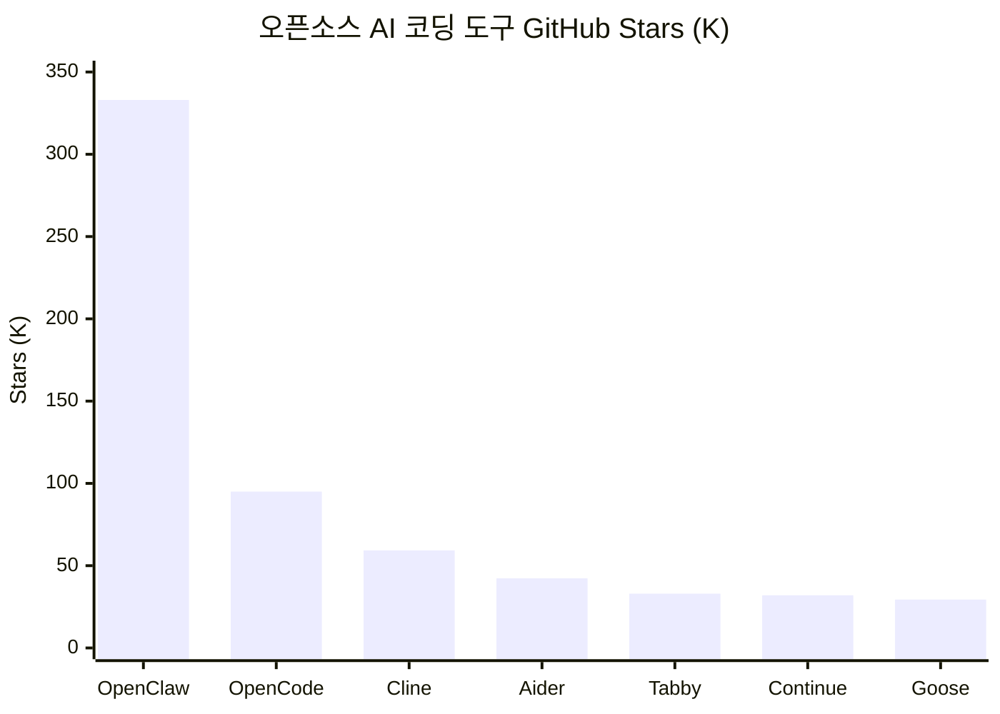

# 뭐쓸까? — AI 도구 비교 가이드

<p align="center">
  <strong>AI 코딩 & 생산성 도구, 진짜 뭐 써야 돼?</strong>
</p>

<p align="center">
  <a href="#-코딩-도구-에이전트--ide"></a>
  <a href="#-채팅-ai"></a>
  <a href="#-ai-ide"></a>
  <a href="#-앱-빌더"></a>
  <a href="#-오픈소스"></a>
</p>

<p align="center">
  <a href="https://github.com/tykimos/mwossulkka/issues"></a>
  <a href="https://github.com/tykimos/mwossulkka/pulls"></a>
  <a href="LICENSE"></a>
  
  
</p>

<p align="center">
  <em>"도구가 너무 많아서 도구 고르다 하루가 간다" — 2026년 개발자의 흔한 하루</em>
</p>

[코딩 도구](#-코딩-도구-에이전트--ide) · [채팅 AI](#-채팅-ai) · [AI IDE](#-ai-ide) · [코드 어시스턴트](#-코드-어시스턴트-플러그인) · [앱 빌더](#-앱-빌더) · [자율 에이전트](#-자율-에이전트) · [오픈소스](#-오픈소스) · [가격 레이더](#-가격-레이더) · [커뮤니티 비교](#-커뮤니티-반응-비교-중심) · [팩트 체크 로그](#팩트-체크-로그-2026-03-24)

---

## 개발자들이 실제로 쓰는 조합



> *"Cursor는 최고의 AI 에디터. Claude Code는 최고의 AI 엔지니어. Windsurf는 최고의 가성비."*

---

## 뭘 하고 싶어?

```
무엇을 하고 싶어?
│
├─ 코드를 짜고 싶다
│  ├─ 터미널(CLI)에서 → Claude Code | Codex CLI | Gemini CLI | Aider
│  ├─ 새 에디터(IDE)로 → Cursor | Windsurf | Antigravity | Kiro | Trae
│  └─ 기존 IDE에 플러그인 → GitHub Copilot | Tabnine | Amazon Q
│
├─ 앱을 만들고 싶다
│  ├─ 코딩 경험 있다 → Replit Agent | Bolt.new
│  └─ 코딩 경험 없다 → Lovable | v0.app
│
├─ 업무를 자동화하고 싶다
│  ├─ 개발자 → Devin (자율 코딩 에이전트)
│  └─ 비개발자 → Claude Cowork (업무 에이전트)
│
└─ AI한테 물어보고 싶다
   ├─ 범용 → ChatGPT | Claude.ai | Gemini
   ├─ 검색+인용 → Perplexity
   └─ 초대형 컨텍스트 → Grok (2M 토큰)
```

---

## 카테고리별 인기 순위

### 코딩 도구 (에이전트 + IDE)

| 순위 | 도구 | 카테고리 | 근거 |
|:---:|---|---|---|
| 1 | **[Claude Code](https://code.claude.com)** | 코딩 에이전트 | SWE-bench 1위 (80.9%), 코드 품질 최강, 67% 블라인드 테스트 승률 |
| 2 | **[Cursor](https://cursor.com)** | AI IDE | $29.3B 밸류, NVIDIA 4만 엔지니어 사용, 탭 자동완성 최강 |
| 3 | **[GitHub Copilot](https://github.com/features/copilot)** | AI IDE/플러그인 | 가장 널리 채택된 AI 개발 도구, 9+ IDE, $10/월 최저가 |
| 4 | **[Windsurf](https://windsurf.com)** | AI IDE | LogRocket 2026 1위, Cascade 메모리, 대규모 코드베이스 강점 |
| 5 | **[Codex CLI](https://developers.openai.com/codex/cli)** | 코딩 에이전트 | 출시 1개월 100만 개발자, 안전한 샌드박스, 240+ tok/s |

### 범용 AI 채팅

| 순위 | 도구 | 근거 |
|:---:|---|---|
| 1 | **[ChatGPT](https://chatgpt.com)** | 주간 9억 사용자, 유료 5천만 명, SuperApp 발표 |
| 2 | **[Claude.ai](https://claude.com)** | 1M 컨텍스트, Extended Thinking, 코딩 품질 1위 |
| 3 | **[Gemini](https://gemini.google.com)** | 시장 점유율 5.4%→18.2% 급성장, 영상/이미지 생성 |
| 4 | **[Perplexity](https://www.perplexity.ai)** | 검색+인용 통합의 유일무이, Computer 에이전트 |
| 5 | **[Grok](https://x.ai)** | 2M 컨텍스트 (업계 최대), X 실시간 데이터 |

### 오픈소스

| 순위 | 도구 | Stars | 근거 |
|:---:|---|---|---|
| 1 | **[OpenClaw](https://github.com/openclaw/openclaw)** | 333K | 범용 AI, 50+ 메신저, 5400+ Skills |
| 2 | **[Cline](https://github.com/cline/cline)** | 59.3K | VS Code 에이전트, 5M+ 설치 |
| 3 | **[Aider](https://aider.chat)** | 42.3K | Git-first, 4.1M 설치, 모든 LLM |
| 4 | **[Tabby](https://github.com/TabbyML/tabby)** | 33K | 완전 온프레미스, 코드 외부 전송 0% |
| 5 | **[Goose](https://github.com/block/goose)** | 29.4K | Block(Square) 제작, MCP 통합 |

---

## 전체 지도

```
뭐쓸까?
├── 채팅 AI
│   ├── ChatGPT ········· OpenAI, GPT-5.4, $0~200/월
│   ├── Claude.ai ······· Anthropic, Opus 4.6, $0~200/월
│   ├── Gemini ·········· Google, 3.1 Pro, $0~250/월
│   ├── Copilot (MS) ···· Microsoft, M365 통합, $0~30/월
│   ├── Grok ············ xAI, 2M 컨텍스트, $0~30/월
│   └── Perplexity ······ 검색+인용, $0~325/월
│
├── 코딩 에이전트 (CLI)
│   ├── Claude Code ····· Anthropic, SWE-bench 1위, $20/월~
│   ├── Codex CLI ······· OpenAI, 샌드박스, $20/월~
│   ├── Gemini CLI ······ Google, 무료 1,000 req/일
│   └── Aider ··········· 오픈소스, 모든 LLM, $0
│
├── AI IDE
│   ├── Cursor ·········· 탭 자동완성 최강, $0~200/월
│   ├── Windsurf ········ Cascade 메모리, $0~200/월
│   ├── Antigravity ····· Google, 멀티에이전트, $0~250/월
│   ├── Kiro ············ AWS, Spec 기반, $0~200/월
│   ├── Trae ············ ByteDance, 최저가, $0~100/월
│   └── GitHub Copilot ·· 9+ IDE, $0~39/user/월
│
├── 코드 어시스턴트
│   ├── Amp (구 Cody) ··· Enterprise 전용
│   ├── Tabnine ········· 에어갭 배포, $39/user/월~
│   └── Amazon Q ········ AWS 네이티브, $0~19/user/월
│
├── 앱 빌더
│   ├── Bolt.new ········ 브라우저 IDE, $0~25/월
│   ├── v0.app ·········· Vercel 통합, $0~100/user/월
│   ├── Lovable ········· 비개발자 친화, $0~50/월
│   └── Replit Agent ···· 올인원 배포, $0~95/월
│
├── 자율 에이전트
│   ├── Claude Cowork ··· 비개발자 업무, $20/월~
│   └── Devin ··········· 자율 코딩, $20/월~
│
└── 오픈소스
    ├── OpenClaw ········· 333K Stars, 범용 AI
    ├── OpenCode ········· 95K Stars, 터미널 에이전트
    ├── Cline ············ 59K Stars, VS Code 에이전트
    ├── Aider ············ 42K Stars, Git-first
    ├── Tabby ············ 33K Stars, 온프레미스
    ├── Continue.dev ····· 32K Stars, CI/CD 통합
    └── Goose ············ 29K Stars, Block 제작
```

---

## 채팅 AI

> 웹/앱에서 대화하며 코딩 질문, 코드 생성, 디버깅. 가장 접근성 높은 AI 도구.

| | ChatGPT | Claude.ai | Gemini | Copilot (MS) | Grok | Perplexity |
|---|---|---|---|---|---|---|
| **제공사** | OpenAI | Anthropic | Google | Microsoft | xAI | Perplexity AI |
| **사이트** | [chatgpt.com](https://chatgpt.com) | [claude.com](https://claude.com) | [gemini.google.com](https://gemini.google.com) | [microsoft.com](https://www.microsoft.com/en-us/microsoft-365-copilot) | [x.ai](https://x.ai) | [perplexity.ai](https://www.perplexity.ai) |
| **최신 모델** | GPT-5.4 | Claude Opus 4.6 | Gemini 3.1 Pro | GPT-5.4 + Claude | Grok 4.20 | Sonar Pro |
| **무료** | O | O | O | O | O | O |
| **시작가** | $8/월 (Go) | $20/월 (Pro) | $19.99/월 | $18/월 | $30/월 | $20/월 |
| **최고가** | $200/월 (Pro) | $200/월 (Max) | $249.99/월 (Ultra) | $30/월 | $30/월 | $325/seat/월 |
| **컨텍스트** | 128K | **1M** | 1M | — | **2M** | 모델별 |
| **킬러 피처** | Canvas + Codex | Extended Thinking | 영상/이미지 생성 | M365 통합 | X 실시간 데이터 | 검색+인용 |

> *"ChatGPT는 만능 스위스 나이프, Claude는 장인의 메스, Gemini는 Google 생태계의 열쇠"*

---

## 코딩 에이전트 (CLI)

> 터미널에서 코드베이스를 직접 읽고, 자율적으로 코드를 고친다. 2026년 가장 뜨거운 카테고리.



| | Claude Code | Codex CLI | Gemini CLI | Aider |
|---|---|---|---|---|
| **사이트** | [code.claude.com](https://code.claude.com) | [openai.com/codex](https://developers.openai.com/codex/cli) | [gemini-cli](https://github.com/google-gemini/gemini-cli) | [aider.chat](https://aider.chat) |
| **오픈소스** | X | O (Rust) | O (Apache 2.0) | O (Apache 2.0) |
| **무료** | X | X | **1,000 req/일** | **O (API만)** |
| **시작가** | $20/월 | $20/월 | $0 | $0 |
| **모델** | Anthropic만 | OpenAI만 | Gemini만 | **모든 LLM** |
| **컨텍스트** | 200K+ | GPT-5 | **1M** | 모델별 |
| **샌드박스** | X | **O** | X | X |
| **멀티에이전트** | **O** | O | X | X |
| **MCP** | **300+** | O | O | X |
| **Git** | O | 부분적 | 부분적 | **네이티브** |

<details>
<summary><b>커뮤니티가 말하는 CLI 에이전트</b></summary>

> *"Claude Code는 생각하는 작업에, Codex는 실행하는 작업에."* — r/ChatGPTCoding 500+ 개발자 설문

> *"$20 Plus 플랜으로 하루종일 코딩해도 한도에 걸린 적 없다."* — Reddit u/LaCaipirinha (31 upvotes)

> *"한 번 복잡한 프롬프트 날리면 5시간 한도의 50~70%가 날아간다."* — r/ChatGPTCoding (388 upvotes)

**2026 파워 스택 공식**:
```
일상 코딩 = Codex CLI (키스트로크 레벨)
커밋/아키텍처 = Claude Code (사고 레벨)
무료 = Gemini CLI + Aider
```

</details>

---

## AI IDE

> 에디터 자체에 AI가 통합. 자동완성부터 멀티파일 에이전트까지.



| | Cursor | Windsurf | Antigravity | Kiro | Trae | GH Copilot |
|---|---|---|---|---|---|---|
| **제공사** | Cursor Inc. | Cognition AI | Google DeepMind | AWS | ByteDance | GitHub |
| **사이트** | [cursor.com](https://cursor.com) | [windsurf.com](https://windsurf.com) | [antigravity.google](https://antigravity.google) | [kiro.dev](https://kiro.dev) | [trae.ai](https://www.trae.ai) | [github.com](https://github.com/features/copilot) |
| **무료** | O | O | O (프리뷰) | O (50 cr) | **O (강력)** | O (2K/월) |
| **시작가** | $20/월 | $20/월 | $20/월 (AI Pro) | $20/월 | **$3/월** | **$10/월** |
| **최고가** | $200/월 | $200/월 | $249.99/월 | $200/월 | $100/월 | $39/user/월 |
| **모델** | Multi | Multi+SWE-1.5 | Gemini+Claude+GPT | Claude | Claude+GPT+DeepSeek | Multi |
| **킬러 피처** | Autonomy Slider | Cascade 메모리 | Manager View | Spec 기반 EARS | 최저가 | 9+ IDE |

<details>
<summary><b>커뮤니티 반응: IDE 전쟁</b></summary>

> *"Cursor: 더 비싸게, 덜 주고, 어떻게 작동하는지 묻지 마."* — r/programming

> *"Windsurf는 50만 줄 모노레포에서 컨텍스트를 더 잘 잡고 에러가 적었다."* — r/ChatGPTCoding

**Antigravity 쿼터 논란** (2026.03):
> *"1월엔 주당 3억 토큰 썼는데, 지금은 900만 토큰에서 한도 걸린다."* — Google AI for Developers 포럼

**Trae 프라이버시 경고**:
> *"30초마다 ByteDance 도메인 5곳에 데이터 전송. 텔레메트리 끄기 설정해도 계속 전송."* — Unit 221B 보안 분석

</details>

---

## 코드 어시스턴트 (플러그인)

> 기존 IDE(VS Code, JetBrains 등)에 플러그인으로 추가하는 AI 도구.

| | Amp (구 Cody) | Tabnine | Amazon Q Developer |
|---|---|---|---|
| **제공사** | Sourcegraph | Tabnine | AWS |
| **사이트** | [ampcode.com](https://ampcode.com) | [tabnine.com](https://www.tabnine.com) | [aws.amazon.com/q](https://aws.amazon.com/q/developer) |
| **무료** | **X (Enterprise만)** | **X (2025 종료)** | O (50 req/월) |
| **시작가** | Enterprise 문의 | $39/user/월 (연간) | $19/user/월 |
| **에어갭** | O | **O** | X |
| **대상** | 대규모 모노레포 | 금융/의료/국방 | AWS 기반 팀 |
| **주의** | Cody Free/Pro 2025.07 폐지 | 무료 플랜 없음 | Pro 아니면 한도 적음 |

---

## 앱 빌더

> 코딩 없이(또는 최소한으로) 앱을 만들고 배포까지. "바이브 코딩"의 본거지.

| | Bolt.new | v0.app | Lovable | Replit Agent |
|---|---|---|---|---|
| **사이트** | [bolt.new](https://bolt.new) | [v0.app](https://v0.app) | [lovable.dev](https://lovable.dev) | [replit.com](https://replit.com) |
| **무료** | O (1M 토큰) | O ($5 크레딧) | O (일 5 크레딧) | O (체험) |
| **시작가** | $25/월 | $30/user/월 | $25/월 | $17/월 |
| **배포** | Netlify | **Vercel** | 내장 | **내장+호스팅** |
| **DB** | Bolt Cloud | X | Supabase | PostgreSQL |
| **디자인** | Figma | Design Mode | Chat Mode | Design Canvas |
| **협업** | O | O | **20명 실시간** | 15명 |

<details>
<summary><b>커뮤니티 반응: 앱 빌더</b></summary>

> *"v0은 UI에, Bolt는 풀스택 속도에, Lovable은 DB 필요한 초보자에."*

> *"버그 하나 고치면 새 버그 셋이 생기고 월 크레딧이 디버깅 한 세션에 증발한다."* — Lovable 사용자 공통 불만

**보안 주의**: 세 플랫폼 모두 생성 코드의 **40~45%에 취약점** 포함 (NxCode 2026 분석). 어떤 빌더를 쓰든 보안 리뷰 필수.

</details>

---

## 자율 에이전트

> "이거 해줘" 하면 알아서 연구, 계획, 실행, 검증까지. 가장 미래적인 카테고리.

| | Claude Cowork | Devin |
|---|---|---|
| **사이트** | [claude.com](https://claude.com) | [devin.ai](https://devin.ai) |
| **대상** | 비개발자 오피스 워커 | 소프트웨어 엔지니어 |
| **환경** | 데스크톱 앱 | 클라우드 IDE |
| **시작가** | $20/월 (Pro) | $20/월 (Core, ACU별 과금) |
| **연동** | Drive, Gmail, Slack, DocuSign | GitHub, 자체 IDE |
| **과금** | 구독 | ACU ($2.25/unit, ~15분) |

<details>
<summary><b>커뮤니티 반응: 자율 에이전트</b></summary>

**Claude Cowork:**
> *"정리해달라고 했더니 '쓸모없다'고 판단한 파일 11GB를 삭제했다."* — 실사용자 경험담

> *"AI 경험 제로인 주니어가 45분 만에 쓸 줄 알게 되고, 이틀 차에 복잡한 작업을 위임하고 있었다."* — Hackceleration 6주 테스트

**Devin:**
> *"$500/월 Team은 잘 정의된 대량 백로그가 있어야만 가치가 있다. 모호한 작업은 Claude Code $20/월이 이긴다."* — Reddit 컨센서스

</details>

---

## 오픈소스

> 무료. 내 모델. 내 서버. 내 데이터. 자유의 땅.



| | OpenClaw | OpenCode | Cline | Aider | Tabby | Continue | Goose |
|---|---|---|---|---|---|---|---|
| **Stars** | **333K** | 95K+ | 59.3K | 42.3K | 33K | 32K | 29.4K |
| **라이선스** | MIT | OSS | Apache 2.0 | Apache 2.0 | — | Apache 2.0 | Apache 2.0 |
| **유형** | 범용 AI | 터미널 에이전트 | VS Code 에이전트 | CLI 에이전트 | 코드 완성 | IDE+CI | 자율 에이전트 |
| **모델** | 다중 | 75+ | 다중+Ollama | **모든 LLM** | 로컬 전용 | 모든 모델 | 모든 LLM |
| **킬러 피처** | 50+ 메신저, 5400 Skills | TUI, LSP, 세션 공유 | 5M+ 설치 | Git-first | 코드 외부 전송 0% | CI/CD 통합 | Block 제작, MCP |

---

## 가격 레이더

### 무료

| 도구 | 무료 범위 |
|---|---|
| **[Gemini CLI](https://github.com/google-gemini/gemini-cli)** | 1,000 req/일 (실용적 수준) |
| **[Aider](https://aider.chat)** | 완전 무료 (API 비용만) |
| **[GitHub Copilot](https://github.com/features/copilot)** | 2,000 완성 + 50 프리미엄/월 |
| **[Trae](https://www.trae.ai)** | $3 상당 무료 + 5,000 자동완성 |
| **[Antigravity](https://antigravity.google)** | 프리뷰 무료 (Gemini 3 Pro) |

### ~$10/월

| 도구 | 가격 | 포함 내용 |
|---|---|---|
| **[Trae Lite](https://www.trae.ai)** | $3/월 | $5 상당 사용량 |
| **[ChatGPT Go](https://chatgpt.com)** | $8/월 | GPT-5.3 Instant |
| **[GitHub Copilot Pro](https://github.com/features/copilot)** | $10/월 | 무제한 자동완성 + 에이전트 |
| **[Trae Pro](https://www.trae.ai)** | $10/월 | 무제한 자동완성 + $20 상당 |

### $20/월 격전지 — 8개 도구가 같은 가격에 경쟁

| 도구 | 포함 내용 |
|---|---|
| **[ChatGPT Plus](https://chatgpt.com)** | GPT-5.2 + Codex |
| **[Claude Pro](https://claude.com)** | Claude Code + Cowork 포함 |
| **[Cursor Pro](https://cursor.com)** | 자동완성 + Cloud Agent |
| **[Windsurf Pro](https://windsurf.com)** | Cascade + SWE-1.5 |
| **[Kiro Pro](https://kiro.dev)** | 1,000 크레딧 |
| **[Perplexity Pro](https://www.perplexity.ai)** | 무제한 Pro 쿼리 |
| **[Devin Core](https://devin.ai)** | ACU 기반 에이전트 |
| **[Antigravity](https://antigravity.google)** | Google AI Pro |

### $100+/월

| 도구 | 가격 | 포함 내용 |
|---|---|---|
| **[Trae Ultra](https://www.trae.ai)** | $100/월 | $400 상당 + 신모델 선공개 |
| **[Claude Max](https://claude.com)** | $100~200/월 | 5x~20x Pro 사용량 |
| **[ChatGPT Pro](https://chatgpt.com)** | $200/월 | GPT-5.4 Pro + 무제한 |
| **[Cursor Ultra](https://cursor.com)** | $200/월 | 20x 사용량 |
| **[Windsurf Max](https://windsurf.com)** | $200/월 | 대용량 할당 |
| **[Antigravity Ultra](https://antigravity.google)** | $249.99/월 | Google AI Ultra |

---

## 커뮤니티 반응 (비교 중심)

> 실제 Reddit, Hacker News, 개발자 포럼에서 수집한 **서비스 간 직접 비교** 인용문.

### Claude Code vs Codex CLI

> *"프로덕션 코딩에서 꽤 엄격한 계획을 세운다. Codex는 대부분 계획을 벗어난다. Claude는 따른다."*
> — Hacker News `2025.12`

> *"Codex-medium은 잘 짜인 계획이 있을 때 더 낫고... Sonnet 4.5는 그 외 모든 것에 낫다."*
> — HN user "extr" (141 points) `2025.12`

> *"Codex를 쓰면서 15년 만에 처음으로 코딩이 다시 즐거워졌다."*
> — HN user "nl" (94 points) `2025.12`

> *"한 번 복잡한 프롬프트 날리면 5시간 한도의 50~70%가 날아간다."*
> — r/ClaudeAI (388 upvotes) `2026.02`

> *"$20 Plus 플랜으로 하루종일 코딩해도 한도에 걸린 적 없다."*
> — Reddit u/LaCaipirinha (31 upvotes) `2026.01`

| 상황 | 승자 |
|---|---|
| 계획 따르기, 복잡한 추론 | **Claude Code** |
| 사용량 한도 걱정 없이 | **Codex CLI** |
| 구조화된 작업 | **Codex CLI** |
| 어려운 디버깅 | **Claude Code** |

### Claude Code vs Cursor

> *"Cursor는 이미 아는 걸 더 빠르게 해준다. 가속기다. Claude Code는 대신 해준다. 위임자다."*
> — Builder.io `2026.01`

> *"무료 Cursor 구독을 줘도 Claude Code를 포기해야 한다면 거부하겠다."*
> — r/ClaudeCode `2026.02`

> *"Claude Code는 동일 작업에 Cursor 대비 5.5배 적은 토큰을 쓴다."*
> — Northflank 벤치마크 `2026.03`

| 상황 | 승자 |
|---|---|
| 일상 인라인 편집, 비주얼 diff | **Cursor** |
| 자율 멀티파일 작업, 어려운 문제 | **Claude Code** |
| 토큰 효율성 | **Claude Code** |

### Cursor vs Windsurf

> *"Cursor: 더 비싸게, 덜 주고, 어떻게 작동하는지 묻지 마."*
> — r/programming `2025.H2`

> *"Windsurf는 50만 줄 모노레포에서 컨텍스트를 더 잘 잡고 에러가 적었다."*
> — r/ChatGPTCoding `2026.02`

> *"코드를 좀 아는 개발자라면 Cursor를 골라라. 기존 코드 위에서 반복 작업할 때 훨씬 낫다."*
> — r/webdev `2026.01`

| 상황 | 승자 |
|---|---|
| 대규모 코드베이스, 예산 팀 | **Windsurf** |
| 복잡한 리팩토링, human-in-the-loop | **Cursor** |

### Cursor vs Antigravity

> *"실제로 내 코드베이스를 이해하는 사람과 페어 프로그래밍하는 느낌이다."*
> — Cursor 지지자, Bind AI `2026.03`

> *"Antigravity가 캐시 삭제 작업을 잘못 해석해서 유저의 D 드라이브 전체를 날렸다."*
> — r/programming, HN `2026.01`

| 상황 | 승자 |
|---|---|
| 안전성, 예측 가능성, 프로덕션 | **Cursor** |
| 멀티에이전트 자율 실행 (위험 감수) | Antigravity |

### Windsurf vs Antigravity

> *"Antigravity에서 Opus로 코딩하다가 Gemini로 강제 전환되는 순간은, 무모한 운전자에게 핸들을 넘기는 것과 같다."*
> — r/ClaudeAI `2026.03`

> *"수개월간의 조용한 쿼터 축소, 167시간 잠금, Pro 플랜 5시간 갱신 약속 위반 후... 수천 명이 대안을 찾고 있다."*
> — "Antigravity 엑소더스" `2026.03.12`

| 상황 | 승자 |
|---|---|
| 모델 일관성, 성숙도 | **Windsurf** |
| 완전 무료 프리뷰 (쿼터 안에서) | Antigravity |

### ChatGPT vs Claude (코딩)

> *"Claude가 Python에서 GPT4를 압도한다."*
> — r/programming `2026.01`

> *"어제 Claude로 갈아탔는데 폰 앱 전체를 만들어줬다. 내 말을 진짜 듣는 느낌이다."*
> — r/programming `2026.02`

| 상황 | 승자 |
|---|---|
| 코딩 품질 (78% 선호) | **Claude** |
| 범용성, 생태계 폭 | **ChatGPT** |

### Gemini CLI vs Claude Code

> *"당연히 Claude Code지."*
> — Composio.dev, 양쪽 테스트 후 한마디 결론 `2026.02`

> Claude 1시간 17분 / $4.80 vs Gemini CLI 2시간 2분 / $7.06 `2026.02`

| 상황 | 승자 |
|---|---|
| 속도, 품질, 토큰 효율 | **Claude Code** |
| 무료 사용 (1,000 req/일) | **Gemini CLI** |

### GitHub Copilot vs Cursor

> *"Copilot이 더 세련되고 안정적이다. VSCode 쓰는 사람은 설정도 쉽고, 모델도 다양하고, GitHub 관련 컨텍스트 이해가 훨씬 낫다."*
> — AlexLamper, GitHub Community (accepted answer) `2025.11`

| 상황 | 승자 |
|---|---|
| VSCode 일상 사용, 저비용, GitHub 통합 | **GitHub Copilot** |
| 멀티파일 리팩토링, 대규모 에이전트 | **Cursor** |

### Trae vs Cursor

> *"프로프라이어터리 코드를 ByteDance 서버로 보내는 건 진짜 법적/컴플라이언스 리스크다."*
> — Unit 221B 보안 분석 `2025.03`, 커뮤니티 재확인 `2026.03`

> *"공짜... 직장을 잃기 전까지는."*
> — r/programming, r/netsec `2026.02`

| 상황 | 승자 |
|---|---|
| 무료 솔로 프로토타이핑 (비기업) | **Trae** |
| 프로덕션, 기업 코드 | **Cursor** |

### 앱 빌더: Bolt vs Lovable vs v0

> *"v0은 UI에, Bolt는 풀스택 속도에, Lovable은 DB 필요한 초보자에."*
> — Y Build `2026.03`

> *"세 플랫폼 모두 생성 코드의 40~45%에 취약점."*
> — NxCode `2026.02`

| 상황 | 승자 |
|---|---|
| UI/컴포넌트 디자인 | **v0** |
| 풀스택 속도, 프레임워크 유연성 | **Bolt.new** |
| 비개발자, Supabase 통합 | **Lovable** |

---

## The Ultimate 한 줄 평

| 도구 | 한마디 |
|---|---|
| **Cursor** | *"최고의 AI 에디터"* |
| **Claude Code** | *"최고의 AI 엔지니어"* |
| **Windsurf** | *"최고의 가성비"* |
| **Codex CLI** | *"가장 안전한 실행기"* |
| **Gemini CLI** | *"무료의 왕"* |
| **Antigravity** | *"$24억짜리 베이트 앤 스위치"* |
| **Trae** | *"공짜 치곤 너무 좋은데... 대가가 뭐지?"* |
| **Aider** | *"자유의 상징"* |
| **Devin** | *"비싸지만 진짜 자율"* |
| **Claude Cowork** | *"비개발자의 Claude Code"* |

### 실전 추천 스택

```
시니어 개발자  = Cursor (일상) + Claude Code (아키텍처) = $40/월
가성비 개발자  = Windsurf + Gemini CLI              = $20/월
오픈소스 매니아 = Aider + Ollama                     = $0/월
스타트업 MVP   = Lovable or Bolt.new                = $25/월
기업 보안팀    = Tabnine + Amazon Q                  = $58/user/월
```

---

## 기여하기

AI 도구 시장은 매주 바뀝니다. 정보가 오래됐거나 새 도구가 나왔다면:

- **[PR 보내기](https://github.com/tykimos/mwossulkka/pulls)** — 가격 업데이트, 새 도구 추가, 오류 수정
- **[Issue 열기](https://github.com/tykimos/mwossulkka/issues)** — "이거 틀렸어요", "이 도구 빠졌어요"
- **Star 눌러주세요** — 더 많은 개발자에게 닿을 수 있게

---

<details>
<summary><b>팩트 체크 로그 (2026-03-24)</b></summary>

모든 가격 정보는 각 서비스의 공식 웹사이트에서 직접 검증했습니다.

| 도구 | 검증 URL | 주요 변경사항 |
|---|---|---|
| ChatGPT | chatgpt.com/pricing | Go 플랜 $8/월 신규 추가 |
| Claude | claude.com/pricing | Max 플랜 확인 ($100~$200/월) |
| Cursor | cursor.com/pricing | Pro+ $60/월 확인, Bugbot 별도 |
| Windsurf | windsurf.com/pricing | Max $200/월 확인 |
| Kiro | kiro.dev/pricing | 500 보너스 크레딧 (30일) |
| GitHub Copilot | github.com/features/copilot/plans | Pro Plus 신규, Enterprise에 Opus 4.6 |
| Devin | devin.ai/pricing | ACU 기반 과금 확인 |
| Bolt | bolt.new/pricing | 토큰 롤오버 2025.07부터 |
| v0 | v0.app/pricing | v0.dev -> v0.app 도메인 변경 |
| Lovable | lovable.dev/pricing | 학생 50% 할인, Q1 Cloud $25 포함 |
| Tabnine | tabnine.com/pricing | 연간 구독만, 무료 폐지 |
| Sourcegraph | sourcegraph.com | Cody Free/Pro 2025.07 폐지, Amp 전환 |
| Trae | docs.trae.ai | 5단계: Free/$3/$10/$30/$100 |
| Antigravity | antigravity.google | Google AI Pro/Ultra 구독의 일부 |

</details>

---

<p align="center">
  
  
</p>

<p align="center">
  <em>이 문서는 공식 사이트 팩트 체크 + 커뮤니티 실사용 반응을 기반으로 작성되었습니다.</em><br>
  <em>가격과 기능은 수시로 변경됩니다. 구독 전 반드시 공식 사이트를 확인하세요.</em>
</p>
