# 뭐쓸까?

### AI 코딩 & 생산성 도구, 진짜 뭐 써야 돼?

*2026년 3월 기준 | 공식 사이트 팩트체크 완료 | 커뮤니티 반응 포함*

> *"도구가 너무 많아서 도구 고르다 하루가 간다"* — 2026년 개발자의 흔한 하루

---

## 2026 인기 순위 TOP 15

> 사용자 수, 커뮤니티 반응, 시장 점유율, GitHub Stars, 벤치마크 종합

| 순위 | 도구 | 카테고리 | 근거 |
|:---:|---|---|---|
| 1 | **ChatGPT** | 채팅 AI | 주간 9억 사용자, 유료 5천만 명 |
| 2 | **GitHub Copilot** | AI IDE/플러그인 | 가장 널리 채택된 AI 개발 도구, 9+ IDE |
| 3 | **Cursor** | AI IDE | $29.3B 밸류, NVIDIA 4만 엔지니어 사용 |
| 4 | **Claude Code** | 코딩 에이전트 | SWE-bench 1위 (80.9%), 코드 품질 최강 |
| 5 | **OpenClaw** | 오픈소스 | GitHub 333K Stars, 범용 AI |
| 6 | **Gemini** | 채팅 AI | 시장 점유율 5.4%→18.2% 급성장 |
| 7 | **Windsurf** | AI IDE | LogRocket 2026 1위, Cascade 메모리 |
| 8 | **Codex CLI** | 코딩 에이전트 | 출시 1개월 100만 개발자, 안전한 샌드박스 |
| 9 | **Cline** | 오픈소스 | 59.3K Stars, 5M+ VS Code 설치 |
| 10 | **Antigravity** | AI IDE | Google $24억 투자, 쿼터 논란에도 화제성 |
| 11 | **Aider** | 코딩 에이전트/오픈소스 | 42.3K Stars, 4.1M 설치, Git-first |
| 12 | **Claude.ai** | 채팅 AI | 1M 컨텍스트, Extended Thinking |
| 13 | **Lovable** | 앱 빌더 | $6.6B 밸류, 2,500만 프로젝트 생성 |
| 14 | **Perplexity** | 채팅 AI | 검색+인용 통합의 유일무이 |
| 15 | **Devin** | 자율 에이전트 | 진정한 자율 AI 엔지니어, $500→$20 가격 혁신 |

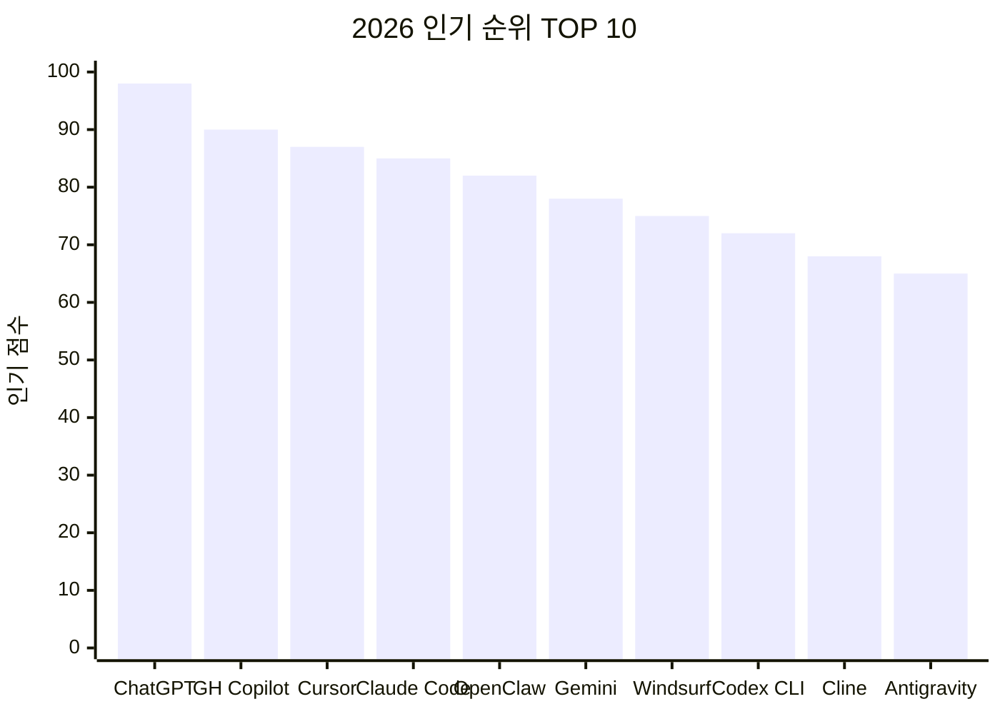

---

## 전체 지도

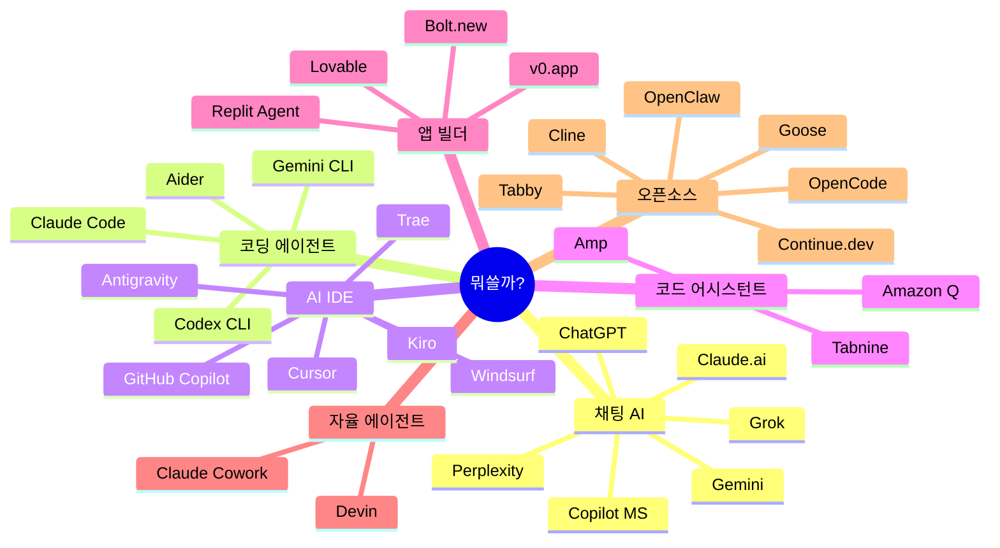

---

## 뭘 하고 싶어?

> "나한테 맞는 도구가 뭐지?" 싶을 때, 아래 플로우를 따라가 보세요.

### 코드를 짜고 싶다

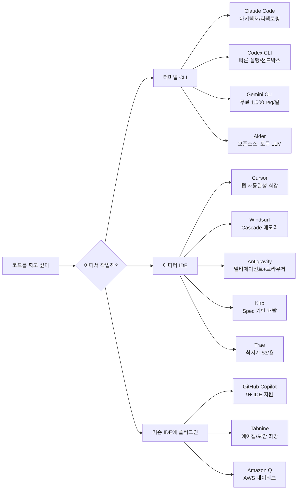

### 앱을 만들거나 업무를 자동화하고 싶다

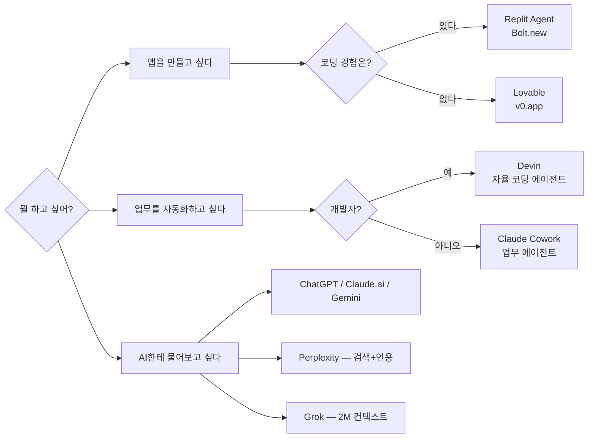

---

## 채팅 AI

> 웹/앱에서 대화하며 코딩 질문, 코드 생성, 디버깅. 가장 접근성 높은 AI 도구.

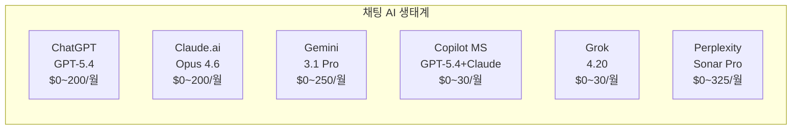

| | ChatGPT | Claude.ai | Gemini | Copilot (MS) | Grok | Perplexity |
|---|---|---|---|---|---|---|
| **제공사** | OpenAI | Anthropic | Google | Microsoft | xAI | Perplexity AI |
| **사이트** | [chatgpt.com](https://chatgpt.com) | [claude.com](https://claude.com) | [gemini.google.com](https://gemini.google.com) | [microsoft.com](https://www.microsoft.com/en-us/microsoft-365-copilot) | [x.ai](https://x.ai) | [perplexity.ai](https://www.perplexity.ai) |
| **최신 모델** | GPT-5.4 | Claude Opus 4.6 | Gemini 3.1 Pro | GPT-5.4 + Claude | Grok 4.20 | Sonar Pro |
| **무료** | O | O | O | O | O | O |
| **시작가** | $8/월 (Go) | $20/월 (Pro) | $19.99/월 | $18/월 | $30/월 | $20/월 |
| **최고가** | $200/월 (Pro) | $200/월 (Max) | $249.99/월 (Ultra) | $30/월 (Enterprise) | $30/월 | $325/seat/월 |
| **컨텍스트** | 128K | **1M** | 1M | — | **2M** | 모델별 |
| **킬러 피처** | Canvas + Codex | Extended Thinking | 영상/이미지 생성 | M365 통합 | X 실시간 데이터 | 검색+인용 |

> *"ChatGPT는 만능 스위스 나이프, Claude는 장인의 메스, Gemini는 Google 생태계의 열쇠"*

---

## 코딩 에이전트 (CLI)

> 터미널에서 코드베이스를 직접 읽고, 자율적으로 코드를 고친다. 2026년 가장 뜨거운 카테고리.

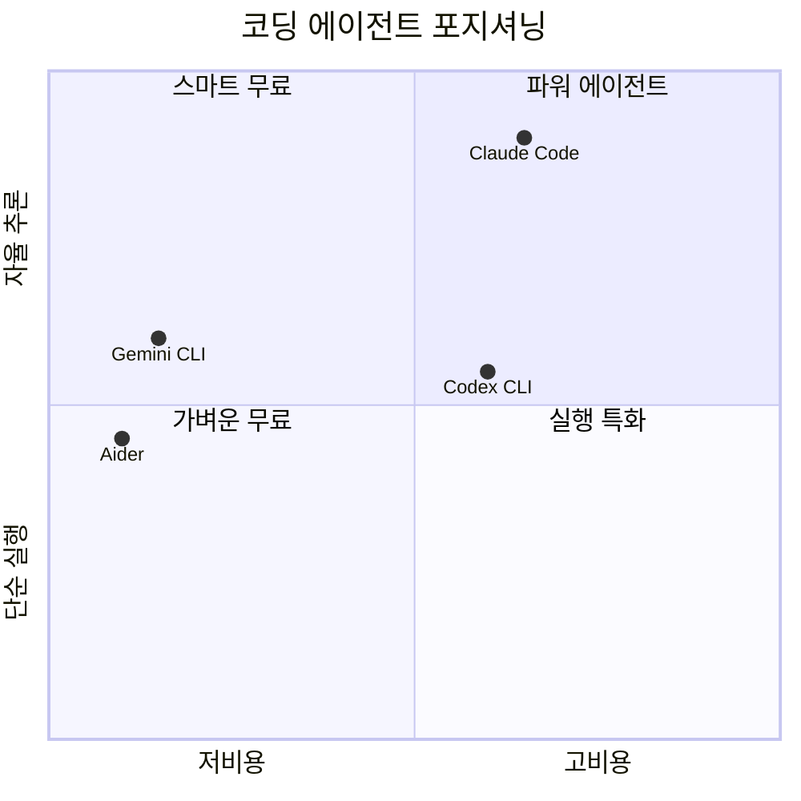

| | Claude Code | Codex CLI | Gemini CLI | Aider |
|---|---|---|---|---|
| **사이트** | [code.claude.com](https://code.claude.com) | [openai.com/codex](https://developers.openai.com/codex/cli) | [gemini-cli](https://github.com/google-gemini/gemini-cli) | [aider.chat](https://aider.chat) |
| **오픈소스** | X | O (Rust) | O (Apache 2.0) | O (Apache 2.0) |
| **무료** | X | X | **1,000 req/일** | **O (API만)** |
| **시작가** | $20/월 | $20/월 | $0 | $0 |
| **모델** | Anthropic만 | OpenAI만 | Gemini만 | **모든 LLM** |
| **컨텍스트** | 200K+ | GPT-5 | **1M** | 모델별 |
| **샌드박스** | X | **O** | X | X |
| **멀티에이전트** | **O** | O | X | X |
| **MCP** | **300+** | O | O | X |
| **Git** | O | 부분적 | 부분적 | **네이티브** |

### 커뮤니티가 말하는 CLI 에이전트

> *"Claude Code는 생각하는 작업에, Codex는 실행하는 작업에."*
> — r/ChatGPTCoding 500+ 개발자 설문

> *"$20 Plus 플랜으로 하루종일 코딩해도 한도에 걸린 적 없다."*
> — Reddit u/LaCaipirinha, Codex CLI 사용자 (31 upvotes)

> *"한 번 복잡한 프롬프트 날리면 5시간 한도의 50~70%가 날아간다."*
> — r/ChatGPTCoding, Claude Code 사용자 (388 upvotes)

**2026 파워 스택 공식**:
```
일상 코딩 = Codex CLI (키스트로크 레벨)
커밋/아키텍처 = Claude Code (사고 레벨)
무료 = Gemini CLI + Aider
```

---

## AI IDE

> 에디터 자체에 AI가 통합. 자동완성부터 멀티파일 에이전트까지.

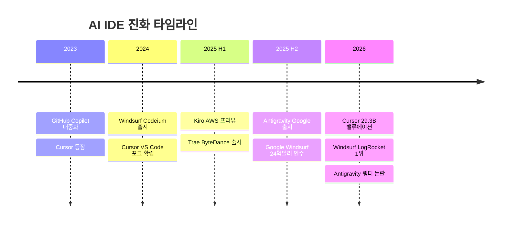

| | Cursor | Windsurf | Antigravity | Kiro | Trae | GH Copilot |
|---|---|---|---|---|---|---|
| **제공사** | Cursor Inc. | Cognition AI | Google DeepMind | AWS | ByteDance | GitHub |
| **사이트** | [cursor.com](https://cursor.com) | [windsurf.com](https://windsurf.com) | [antigravity.google](https://antigravity.google) | [kiro.dev](https://kiro.dev) | [trae.ai](https://www.trae.ai) | [github.com](https://github.com/features/copilot) |
| **무료** | O | O | O (프리뷰) | O (50 cr) | **O (강력)** | O (2K/월) |
| **시작가** | $20/월 | $20/월 | $20/월 (AI Pro) | $20/월 | **$3/월** | **$10/월** |
| **최고가** | $200/월 | $200/월 | $249.99/월 | $200/월 | $100/월 | $39/user/월 |
| **모델** | Multi | Multi+SWE-1.5 | Gemini+Claude+GPT | Claude | Claude+GPT+DeepSeek | Multi |
| **킬러 피처** | Autonomy Slider | Cascade 메모리 | Manager View | Spec 기반 EARS | 최저가 | 9+ IDE |

### 커뮤니티 반응: IDE 전쟁

> *"Cursor: 더 비싸게, 덜 주고, 어떻게 작동하는지 묻지 마."*
> — r/programming (highly upvoted)

> *"Windsurf는 50만 줄 모노레포에서 컨텍스트를 더 잘 잡고 에러가 적었다."*
> — r/ChatGPTCoding

**Antigravity 쿼터 논란** (2026.03):
> *"1월엔 주당 3억 토큰 썼는데, 지금은 900만 토큰에서 한도 걸린다."*
> — Google AI for Developers 포럼

> *"내 말 기억해둬, Google은 크레딧 모델로 갈 거야."*
> — Reddit r/google_antigravity (예언 적중)

**Trae 프라이버시 경고**:
> *"30초마다 ByteDance 도메인 5곳에 데이터 전송. 텔레메트리 끄기 설정해도 계속 전송."*
> — Unit 221B 보안 분석

> *"프로토타입 작업엔 최고. 클라이언트 데이터가 있는 작업엔 절대 안 됨."*
> — Reddit/X 컨센서스

---

## 코드 어시스턴트 (플러그인)

> 기존 IDE(VS Code, JetBrains 등)에 플러그인으로 추가하는 AI 도구.

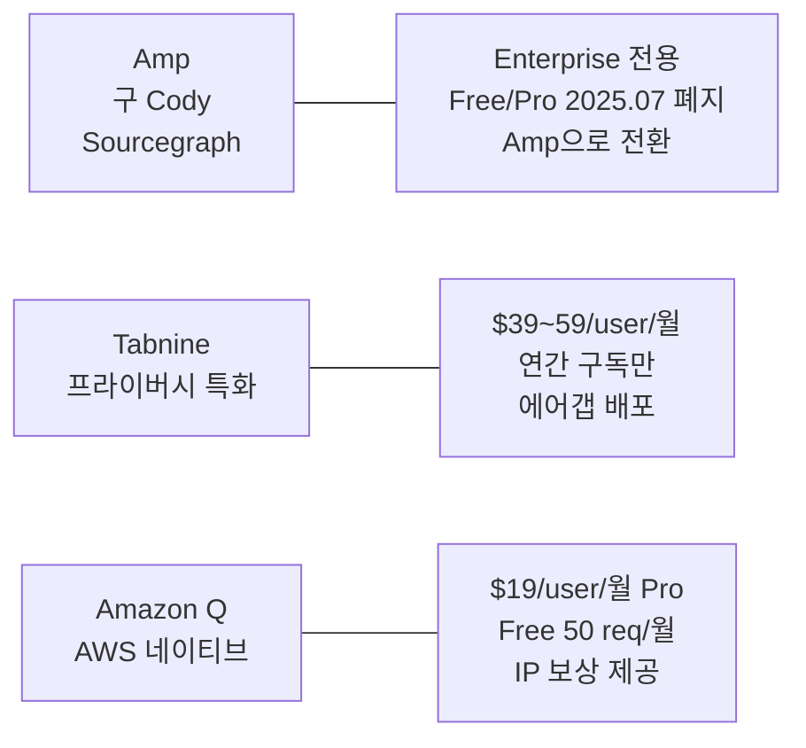

| | Amp (구 Cody) | Tabnine | Amazon Q Developer |
|---|---|---|---|
| **제공사** | Sourcegraph | Tabnine | AWS |
| **사이트** | [ampcode.com](https://ampcode.com) | [tabnine.com](https://www.tabnine.com) | [aws.amazon.com/q](https://aws.amazon.com/q/developer) |
| **무료** | **X (Enterprise만)** | **X (2025 종료)** | O (50 req/월) |
| **시작가** | Enterprise 문의 | $39/user/월 (연간) | $19/user/월 |
| **에어갭** | O | **O** | X |
| **대상** | 대규모 모노레포 | 금융/의료/국방 | AWS 기반 팀 |
| **주의** | Cody Free/Pro 2025.07 폐지 | 무료 플랜 없음 | Pro 아니면 한도 적음 |

---

## 앱 빌더

> 코딩 없이(또는 최소한으로) 앱을 만들고 배포까지. "바이브 코딩"의 본거지.

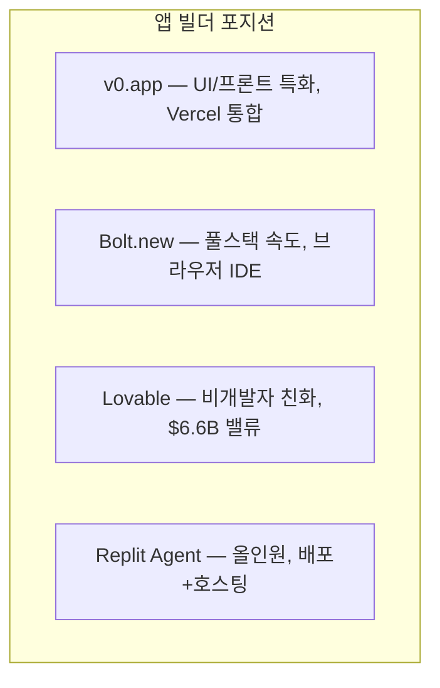

| | Bolt.new | v0.app | Lovable | Replit Agent |
|---|---|---|---|---|
| **사이트** | [bolt.new](https://bolt.new) | [v0.app](https://v0.app) | [lovable.dev](https://lovable.dev) | [replit.com](https://replit.com) |
| **무료** | O (1M 토큰) | O ($5 크레딧) | O (일 5 크레딧) | O (체험) |
| **시작가** | $25/월 | $30/user/월 | $25/월 | $17/월 |
| **배포** | Netlify | **Vercel** | 내장 | **내장+호스팅** |
| **DB** | Bolt Cloud | X | Supabase | PostgreSQL |
| **디자인** | Figma | Design Mode | Chat Mode | Design Canvas |
| **협업** | O | O | **20명 실시간** | 15명 |

### 커뮤니티 한 줄 요약

> *"v0은 UI에, Bolt는 풀스택 속도에, Lovable은 DB 필요한 초보자에."*

> *"레이아웃 만드는 데만 150 메시지 소모했다."* — Lovable 사용자

> *"버그 하나 고치면 새 버그 셋이 생기고 월 크레딧이 디버깅 한 세션에 증발한다."*
> — Lovable 사용자 공통 불만

**보안 주의**: 세 플랫폼 모두 생성 코드의 **40~45%에 취약점** 포함 (NxCode 2026 분석). 어떤 빌더를 쓰든 보안 리뷰 필수.

---

## 자율 에이전트

> "이거 해줘" 하면 알아서 연구, 계획, 실행, 검증까지. 가장 미래적인 카테고리.

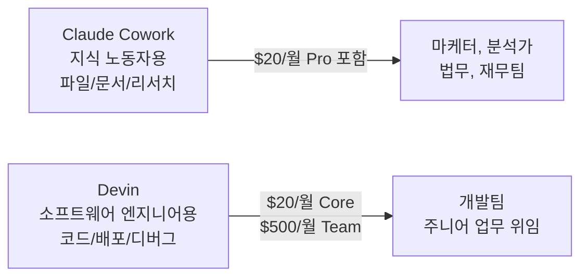

| | Claude Cowork | Devin |
|---|---|---|
| **사이트** | [claude.com](https://claude.com) | [devin.ai](https://devin.ai) |
| **대상** | 비개발자 지식 노동자 | 소프트웨어 엔지니어 |
| **환경** | 데스크톱 앱 | 클라우드 IDE |
| **시작가** | $20/월 (Pro) | $20/월 (Core, ACU별 과금) |
| **연동** | Drive, Gmail, Slack, DocuSign | GitHub, 자체 IDE |
| **과금** | 구독 | ACU ($2.25/unit, ~15분) |

### 커뮤니티 반응

**Claude Cowork:**
> *"정리해달라고 했더니 '쓸모없다'고 판단한 파일 11GB를 삭제했다."*
> — 실사용자 경험담 (widely shared)

> *"AI 경험 제로인 주니어가 45분 만에 쓸 줄 알게 되고, 이틀 차에 복잡한 작업을 위임하고 있었다."*
> — Hackceleration 6주 테스트

**Devin:**
> *"Reddit 사용자에게 허락도 안 받고 웹사이트 제작비 $100를 청구하려 했다."*
> — Analytics India Magazine

> *"$500/월 Team은 잘 정의된 대량 백로그가 있어야만 가치가 있다. 모호한 작업은 Claude Code $20/월이 이긴다."*
> — Reddit 컨센서스

---

## 오픈소스

> 무료. 내 모델. 내 서버. 내 데이터. 자유의 땅.

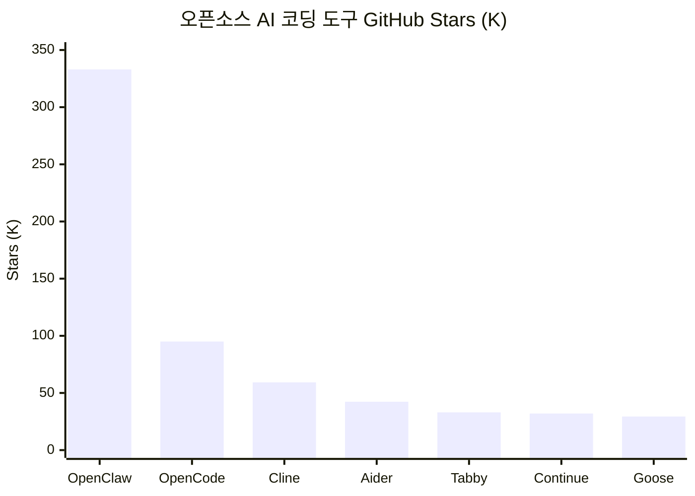

| | OpenClaw | OpenCode | Cline | Aider | Tabby | Continue | Goose |
|---|---|---|---|---|---|---|---|
| **Stars** | **333K** | 95K+ | 59.3K | 42.3K | 33K | 32K | 29.4K |
| **라이선스** | MIT | OSS | Apache 2.0 | Apache 2.0 | — | Apache 2.0 | Apache 2.0 |
| **유형** | 범용 AI | 터미널 에이전트 | VS Code 에이전트 | CLI 에이전트 | 코드 완성 | IDE+CI | 자율 에이전트 |
| **모델** | 다중 | 75+ | 다중+Ollama | **모든 LLM** | 로컬 전용 | 모든 모델 | 모든 LLM |
| **로컬 모델** | O | O | O | O | **O (전용)** | O | O |
| **온프레미스** | O | O | — | — | **O** | O | O |
| **킬러 피처** | 50+ 메신저, 5400 Skills | TUI, LSP, 세션 공유 | 5M+ 설치 | Git-first | 코드 외부 전송 0% | CI/CD 통합 | Block 제작, MCP |

### 커뮤니티 온도

> *"Aider는 git으로 사고한다. 모든 편집이 커밋이고, 모든 세션이 브랜치다. Claude Code는 목표로 사고한다."*

> *"외과적 리팩토링에서 깨끗한 git 로그를 원하면 Aider. 내가 아직 이해 못한 걸 디버깅할 때는 Claude Code."*
> — 개발자 블로그

---

## 가격 레이더

> 월 예산별로 뭘 쓸 수 있는지 한눈에.

### 무료

| 도구 | 무료 범위 |
|---|---|
| Gemini CLI | 1,000 req/일 (실용적 수준) |
| Aider | 완전 무료 (API 비용만) |
| GitHub Copilot | 2,000 완성 + 50 프리미엄/월 |
| Trae | $3 상당 무료 + 5,000 자동완성 |
| Antigravity | 프리뷰 무료 (Gemini 3 Pro) |

### ~$10/월

| 도구 | 가격 | 포함 내용 |
|---|---|---|
| Trae Lite | $3/월 | $5 상당 사용량 |
| ChatGPT Go | $8/월 | GPT-5.3 Instant |
| Cody Pro | $9/user/월 | 대규모 코드베이스 AI |
| GitHub Copilot Pro | $10/월 | 무제한 자동완성 + 에이전트 |
| Trae Pro | $10/월 | 무제한 자동완성 + $20 상당 |

### $20/월 격전지

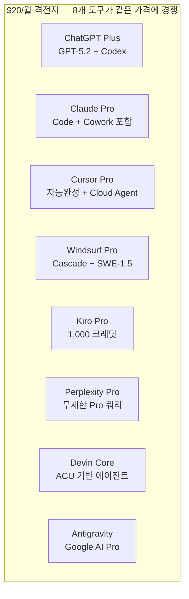

### $100+/월

| 도구 | 가격 | 포함 내용 |
|---|---|---|
| Trae Ultra | $100/월 | $400 상당 + 신모델 선공개 |
| Claude Max | $100~200/월 | 5x~20x Pro 사용량 |
| ChatGPT Pro | $200/월 | GPT-5.4 Pro + 무제한 |
| Cursor Ultra | $200/월 | 20x 사용량 |
| Windsurf Max | $200/월 | 대용량 할당 |
| Antigravity Ultra | $249.99/월 | Google AI Ultra |

---

## 2026 커뮤니티 컨센서스

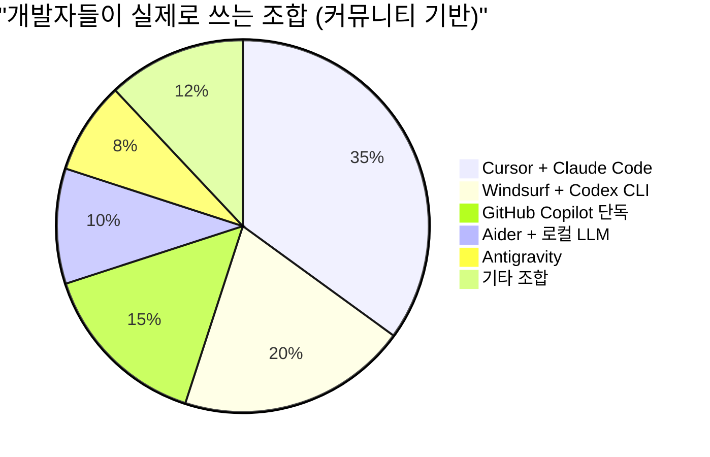

### The Ultimate 한 줄 평

| 도구 | 한마디 |
|---|---|
| **Cursor** | *"최고의 AI 에디터"* |
| **Claude Code** | *"최고의 AI 엔지니어"* |
| **Windsurf** | *"최고의 가성비"* |
| **Codex CLI** | *"가장 안전한 실행기"* |
| **Gemini CLI** | *"무료의 왕"* |
| **Antigravity** | *"$24억짜리 베이트 앤 스위치"* |
| **Trae** | *"공짜 치곤 너무 좋은데... 대가가 뭐지?"* |
| **Aider** | *"자유의 상징"* |
| **Devin** | *"비싸지만 진짜 자율"* |
| **Claude Cowork** | *"비개발자의 Claude Code"* |

### 실전 추천 스택

```
시니어 개발자  = Cursor (일상) + Claude Code (아키텍처) = $40/월
가성비 개발자  = Windsurf + Gemini CLI              = $20/월
오픈소스 매니아 = Aider + Ollama                     = $0/월
스타트업 MVP   = Lovable or Bolt.new                = $25/월
기업 보안팀    = Tabnine + Amazon Q                  = $58/user/월
```

---

## 기여하기

AI 도구 시장은 매주 바뀝니다. 정보가 오래됐거나 새 도구가 나왔다면:

- **PR** 보내주세요 — 가격 업데이트, 새 도구 추가, 오류 수정
- **Issue** 열어주세요 — "이거 틀렸어요", "이 도구 빠졌어요"
- **Star** 눌러주세요 — 더 많은 개발자에게 닿을 수 있게

---

<details>
<summary><b>팩트 체크 로그 (2026-03-24)</b></summary>

모든 가격 정보는 각 서비스의 공식 웹사이트에서 직접 검증했습니다.

| 도구 | 검증 URL | 주요 변경사항 |
|---|---|---|
| ChatGPT | chatgpt.com/pricing | Go 플랜 $8/월 신규 추가 |
| Claude | claude.com/pricing | Max 플랜 확인 ($100~$200/월) |
| Cursor | cursor.com/pricing | Pro+ $60/월 확인, Bugbot 별도 |
| Windsurf | windsurf.com/pricing | Max $200/월 확인 |
| Kiro | kiro.dev/pricing | 500 보너스 크레딧 (30일) |
| GitHub Copilot | github.com/features/copilot/plans | Pro Plus 신규, Enterprise에 Opus 4.6 |
| Devin | devin.ai/pricing | ACU 기반 과금 확인 |
| Bolt | bolt.new/pricing | 토큰 롤오버 2025.07부터 |
| v0 | v0.app/pricing | v0.dev -> v0.app 도메인 변경 |
| Lovable | lovable.dev/pricing | 학생 50% 할인, Q1 Cloud $25 포함 |
| Tabnine | tabnine.com/pricing | 연간 구독만, 무료 폐지 |
| Sourcegraph | sourcegraph.com | Cody Free/Pro 2025.07 폐지, Amp 전환 |
| Trae | docs.trae.ai | 5단계: Free/$3/$10/$30/$100 |
| Antigravity | antigravity.google | Google AI Pro/Ultra 구독의 일부 |

</details>

---

MIT License | 마지막 업데이트: 2026-03-24

> *이 문서는 공식 사이트 팩트 체크 + 커뮤니티 실사용 반응을 기반으로 작성되었습니다.*
> *가격과 기능은 수시로 변경됩니다. 구독 전 반드시 공식 사이트를 확인하세요.*
