# AI 뭐슐랭? — AI 도구 추천비교 가이드

<p align="right">
  <a href="README.md">🇺🇸 English</a> | <b>🇰🇷 한국어</b>
</p>

<p align="center">
  <strong>AI WhatChelin — AI 코딩 & 생산성 도구, 진짜 뭐 써야 돼?</strong><br>
  <sub>마지막 업데이트: 2026-03-24</sub>
</p>

<p align="center">
  <a href="https://chatgpt.com"></a>
  <a href="https://claude.com"></a>
  <a href="https://gemini.google.com"></a>
  <a href="https://cursor.com"></a>
  <a href="https://windsurf.com"></a>
  <a href="https://antigravity.google"></a>
  <a href="https://github.com/features/copilot"></a>
  <a href="https://code.claude.com"></a>
  <a href="https://developers.openai.com/codex/cli"></a>
  <a href="https://github.com/google-gemini/gemini-cli"></a>
  <a href="https://aider.chat"></a>
  <a href="https://kiro.dev"></a>
  <a href="https://www.trae.ai"></a>
  <a href="https://x.ai"></a>
  <a href="https://www.perplexity.ai"></a>
  <a href="https://devin.ai"></a>
  <a href="https://bolt.new"></a>
  <a href="https://v0.app"></a>
  <a href="https://lovable.dev"></a>
  <a href="https://replit.com"></a>
  <a href="https://www.tabnine.com"></a>
  <a href="https://www.midjourney.com"></a>
  <a href="https://openai.com"></a>
  <a href="https://stability.ai"></a>
  <a href="https://ideogram.ai"></a>
  <a href="https://bfl.ai"></a>
  <a href="https://firefly.adobe.com"></a>
  <a href="https://ai.google.dev"></a>
  <a href="https://openai.com/sora"></a>
  <a href="https://runwayml.com"></a>
  <a href="https://klingai.com"></a>
  <a href="https://deepmind.google/technologies/veo"></a>
  <a href="https://pika.art"></a>
  <a href="https://lumalabs.ai"></a>
  <a href="https://hailuoai.video"></a>
  <a href="https://www.microsoft.com/en-us/microsoft-365-copilot"></a>
</p>

<p align="center">
  <em>"도구가 너무 많아서 도구 고르다 하루가 간다" — 2026년 바이브코더의 흔한 하루</em>
</p>

<table align="center">
<tr>
<td align="center">

**매일 새벽 5시, AI가 알아서 업데이트합니다**

이 문서는 사람이 수동으로 관리하지 않습니다.
**매일 KST 05:00**, GitHub Actions + Claude Code가 자동으로:

`32개 AI 도구` · `14개 공식 사이트` · `Reddit / HN / X 커뮤니티` · `가격 페이지`

를 검색하고, 변경사항을 감지하면 즉시 반영합니다.
인기도 점수도 매일 기록되어 **일자별 경쟁 차트**가 자동 갱신됩니다.


<br><br>
<a href="#-바이브코더"></a>
<a href="#-크리에이터"></a>
<a href="#-일반사무"></a>
<br>
<a href="https://github.com/tykimos/ai-whatchelin/issues"></a>
<a href="https://github.com/tykimos/ai-whatchelin/pulls"></a>
<a href="LICENSE"></a>


</td>
</tr>
</table>

[바이브코더](#-바이브코더) · [크리에이터](#-크리에이터) · [일반사무](#-일반사무) · [가격 레이더](#-가격-레이더) · [커뮤니티 비교](#-커뮤니티-반응-비교-중심) · [인기도 트렌드](#-일자별-인기도-트렌드)

---

# 바이브코더

> 코드를 짜고, 앱을 만들고, 자동화하는 바이브코더를 위한 AI 도구들.

<p align="center">
  <a href="https://code.claude.com"></a>
  <a href="https://cursor.com"></a>
  <a href="https://windsurf.com"></a>
  <a href="https://antigravity.google"></a>
  <a href="https://github.com/features/copilot"></a>
  <a href="https://developers.openai.com/codex/cli"></a>
  <a href="https://github.com/google-gemini/gemini-cli"></a>
  <a href="https://aider.chat"></a>
  <a href="https://kiro.dev"></a>
  <a href="https://www.trae.ai"></a>
  <a href="https://bolt.new"></a>
  <a href="https://v0.app"></a>
  <a href="https://lovable.dev"></a>
  <a href="https://replit.com"></a>
  <a href="https://www.tabnine.com"></a>
</p>

### 바이브코더 진화 타임라인

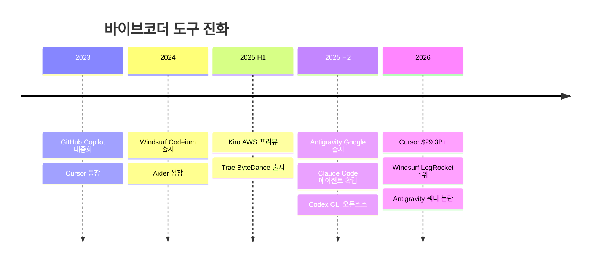

### 바이브코더들이 실제로 쓰는 조합

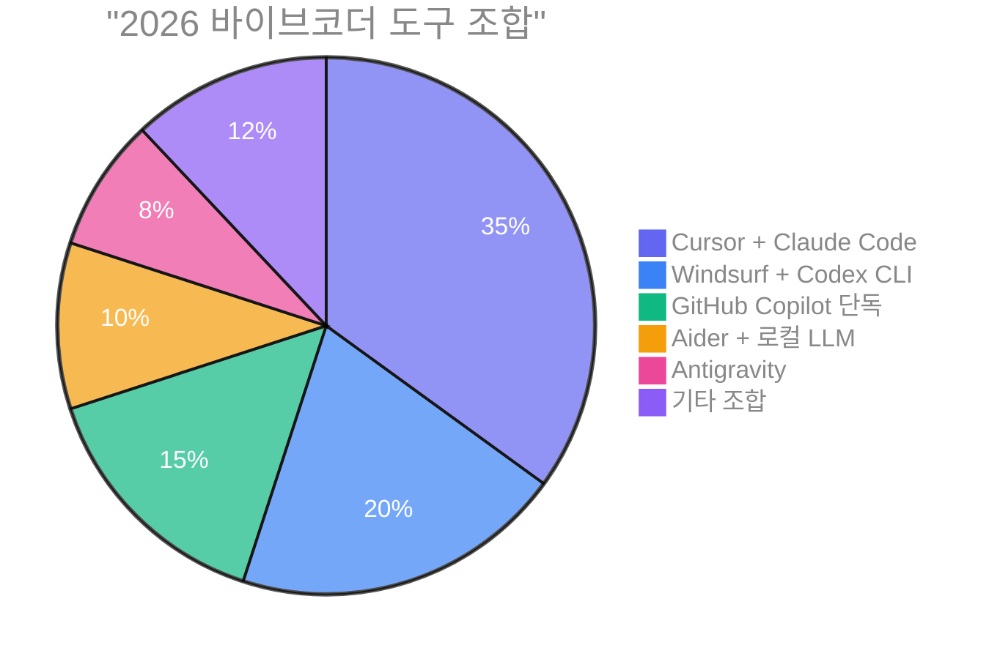

> *"Cursor는 최고의 AI 에디터. Claude Code는 최고의 AI 엔지니어. Windsurf는 최고의 가성비."*

### 나한테 맞는 코딩 도구는?

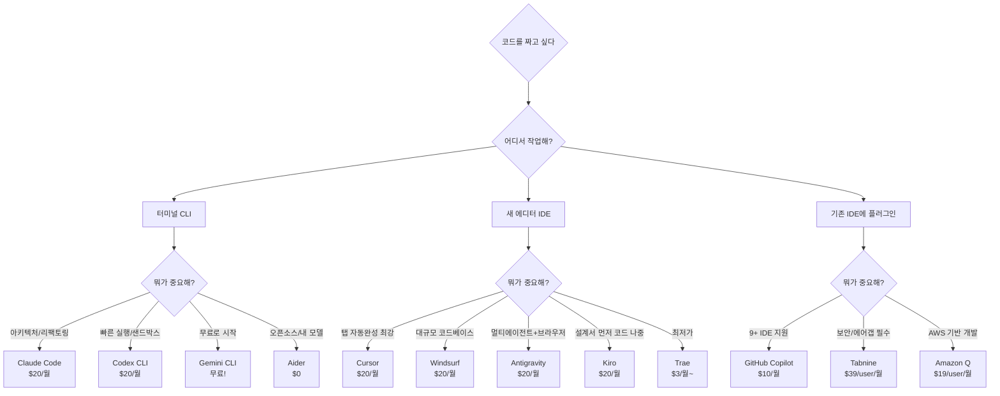

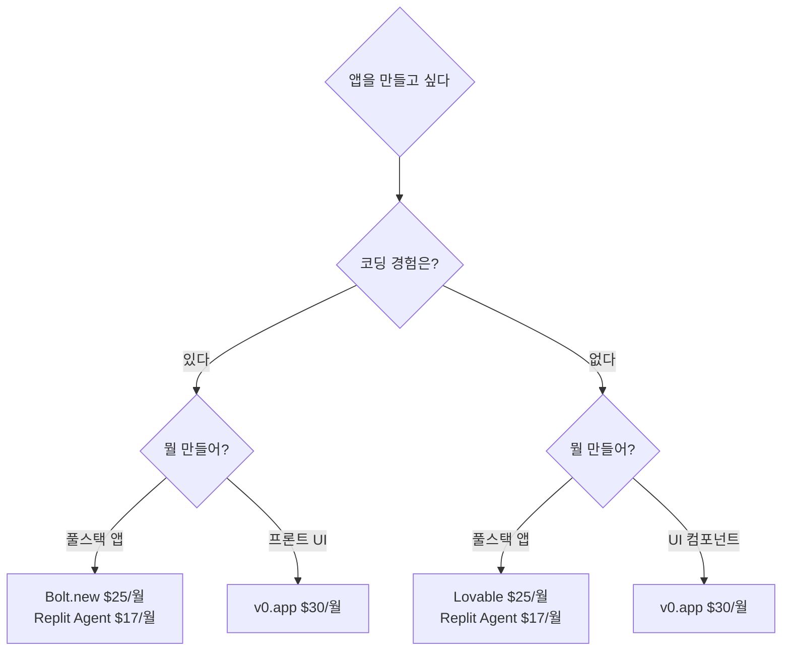

### 바이브코더 인기 순위

| 순위 | 도구 | 카테고리 | 근거 |
|:---:|---|---|---|
| 1 | **[Claude Code](https://code.claude.com)** | 코딩 에이전트 | SWE-bench 1위 (80.9%), 코드 품질 최강, 67% 블라인드 테스트 승률 |
| 2 | **[Cursor](https://cursor.com)** | AI IDE | $29.3B 밸류, NVIDIA 4만 엔지니어 사용, 탭 자동완성 최강 |
| 3 | **[GitHub Copilot](https://github.com/features/copilot)** | AI IDE/플러그인 | 가장 널리 채택된 AI 개발 도구, 9+ IDE, $10/월 최저가 |
| 4 | **[Windsurf](https://windsurf.com)** | AI IDE | LogRocket 2026 1위, Cascade 메모리, 대규모 코드베이스 강점 |
| 5 | **[Codex CLI](https://developers.openai.com/codex/cli)** | 코딩 에이전트 | 출시 1개월 100만 바이브코더, 안전한 샌드박스, 240+ tok/s |

### 바이브코더 전체 지도

```
바이브코더
├── 코딩 에이전트 (CLI)
│   ├── Claude Code ····· Anthropic, SWE-bench 1위, $20/월~
│   ├── Codex CLI ······· OpenAI, 샌드박스, $20/월~
│   ├── Gemini CLI ······ Google, 무료 1,000 req/일
│   └── Aider ··········· 오픈소스, 모든 LLM, $0
│
├── AI IDE
│   ├── Cursor ·········· 탭 자동완성 최강, $0~200/월
│   ├── Windsurf ········ Cascade 메모리, $0~200/월
│   ├── Antigravity ····· Google, 멀티에이전트, $0~250/월
│   ├── Kiro ············ AWS, Spec 기반, $0~200/월
│   ├── Trae ············ ByteDance, 최저가, $0~100/월
│   └── GitHub Copilot ·· 9+ IDE, $0~39/user/월
│
├── 코드 어시스턴트
│   ├── Amp (구 Cody) ··· Enterprise 전용
│   ├── Tabnine ········· 에어갭 배포, $39/user/월~
│   └── Amazon Q ········ AWS 네이티브, $0~19/user/월
│
├── 앱 빌더
│   ├── Bolt.new ········ 브라우저 IDE, $0~25/월
│   ├── v0.app ·········· Vercel 통합, $0~100/user/월
│   ├── Lovable ········· 논코더 친화, $0~50/월
│   └── Replit Agent ···· 올인원 배포, $0~95/월
│
└── 오픈소스
    ├── OpenClaw ········· 333K Stars, 범용 AI
    ├── OpenCode ········· 95K Stars, 터미널 에이전트
    ├── Cline ············ 59K Stars, VS Code 에이전트
    ├── Aider ············ 42K Stars, Git-first
    ├── Tabby ············ 33K Stars, 온프레미스
    ├── Continue.dev ····· 32K Stars, CI/CD 통합
    └── Goose ············ 29K Stars, Block 제작
```

---

## 코딩 에이전트 (CLI)

> 터미널에서 코드베이스를 직접 읽고, 자율적으로 코드를 고친다. 2026년 가장 뜨거운 카테고리.

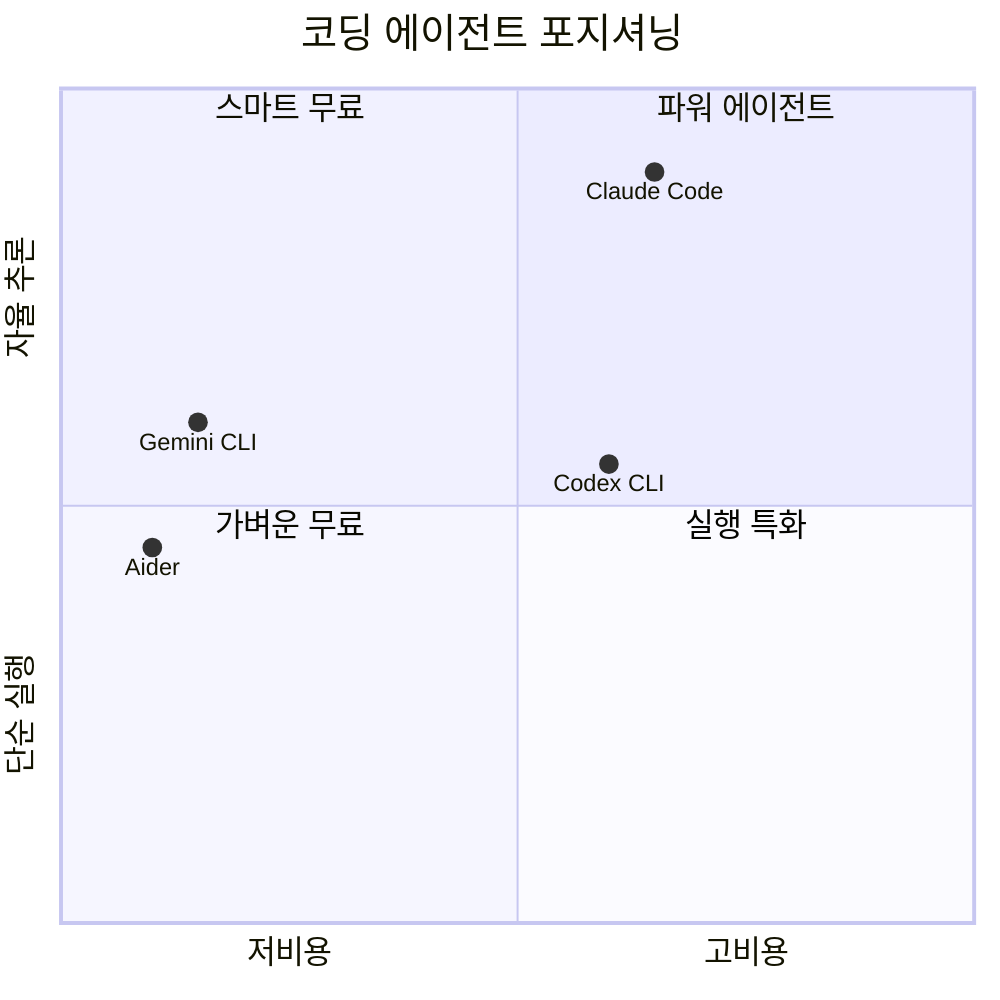

| | Claude Code | Codex CLI | Gemini CLI | Aider |
|---|---|---|---|---|
| **사이트** | [code.claude.com](https://code.claude.com) | [openai.com/codex](https://developers.openai.com/codex/cli) | [gemini-cli](https://github.com/google-gemini/gemini-cli) | [aider.chat](https://aider.chat) |
| **오픈소스** | X | O (Rust) | O (Apache 2.0) | O (Apache 2.0) |
| **무료** | X | X | **1,000 req/일** | **O (API만)** |
| **시작가** | $20/월 | $20/월 | $0 | $0 |
| **모델** | Anthropic만 | OpenAI만 | Gemini만 | **모든 LLM** |
| **컨텍스트** | 200K+ | GPT-5 | **1M** | 모델별 |
| **샌드박스** | X | **O** | X | X |
| **멀티에이전트** | **O** | O | X | X |
| **MCP** | **300+** | O | O | X |
| **Git** | O | 부분적 | 부분적 | **네이티브** |

### 커뮤니티가 말하는 CLI 에이전트

> *"Claude Code는 생각하는 작업에, Codex는 실행하는 작업에."* — r/ChatGPTCoding 500+ 바이브코더 설문

> *"$20 Plus 플랜으로 하루종일 코딩해도 한도에 걸린 적 없다."* — Reddit u/LaCaipirinha (31 upvotes)

> *"한 번 복잡한 프롬프트 날리면 5시간 한도의 50~70%가 날아간다."* — r/ChatGPTCoding (388 upvotes)

**2026 파워 스택 공식**:
```
일상 코딩 = Codex CLI (키스트로크 레벨)
커밋/아키텍처 = Claude Code (사고 레벨)
무료 = Gemini CLI + Aider
```


---

## AI IDE

> 에디터 자체에 AI가 통합. 자동완성부터 멀티파일 에이전트까지.

| | Cursor | Windsurf | Antigravity | Kiro | Trae | GH Copilot |
|---|---|---|---|---|---|---|
| **제공사** | Cursor Inc. | Cognition AI | Google DeepMind | AWS | ByteDance | GitHub |
| **사이트** | [cursor.com](https://cursor.com) | [windsurf.com](https://windsurf.com) | [antigravity.google](https://antigravity.google) | [kiro.dev](https://kiro.dev) | [trae.ai](https://www.trae.ai) | [github.com](https://github.com/features/copilot) |
| **무료** | O | O | O (프리뷰) | O (50 cr) | **O (강력)** | O (2K/월) |
| **시작가** | $20/월 | $20/월 | $20/월 (AI Pro) | $20/월 | **$3/월** | **$10/월** |
| **최고가** | $200/월 | $200/월 | $249.99/월 | $200/월 | $100/월 | $39/user/월 |
| **모델** | Multi | Multi+SWE-1.5 | Gemini+Claude+GPT | Claude | Claude+GPT+DeepSeek | Multi |
| **킬러 피처** | Autonomy Slider | Cascade 메모리 | Manager View | Spec 기반 EARS | 최저가 | 9+ IDE |


### 커뮤니티 반응: IDE 전쟁

> *"Cursor: 더 비싸게, 덜 주고, 어떻게 작동하는지 묻지 마."* — r/programming

> *"Windsurf는 50만 줄 모노레포에서 컨텍스트를 더 잘 잡고 에러가 적었다."* — r/ChatGPTCoding

**Antigravity 쿼터 논란** (2026.03):
> *"1월엔 주당 3억 토큰 썼는데, 지금은 900만 토큰에서 한도 걸린다."* — Google AI for Developers 포럼

**Trae 프라이버시 경고**:
> *"30초마다 ByteDance 도메인 5곳에 데이터 전송. 텔레메트리 끄기 설정해도 계속 전송."* — Unit 221B 보안 분석


---

## 코드 어시스턴트 (플러그인)

> 기존 IDE(VS Code, JetBrains 등)에 플러그인으로 추가하는 AI 도구.

| | Amp (구 Cody) | Tabnine | Amazon Q Developer |
|---|---|---|---|
| **제공사** | Sourcegraph | Tabnine | AWS |
| **사이트** | [ampcode.com](https://ampcode.com) | [tabnine.com](https://www.tabnine.com) | [aws.amazon.com/q](https://aws.amazon.com/q/developer) |
| **무료** | **X (Enterprise만)** | **X (2025 종료)** | O (50 req/월) |
| **시작가** | Enterprise 문의 | $39/user/월 (연간) | $19/user/월 |
| **에어갭** | O | **O** | X |
| **대상** | 대규모 모노레포 | 금융/의료/국방 | AWS 기반 팀 |
| **주의** | Cody Free/Pro 2025.07 폐지 | 무료 플랜 없음 | Pro 아니면 한도 적음 |

---

## 앱 빌더

> 코딩 없이(또는 최소한으로) 앱을 만들고 배포까지. "바이브 코딩"의 본거지.

| | Bolt.new | v0.app | Lovable | Replit Agent |
|---|---|---|---|---|
| **사이트** | [bolt.new](https://bolt.new) | [v0.app](https://v0.app) | [lovable.dev](https://lovable.dev) | [replit.com](https://replit.com) |
| **무료** | O (1M 토큰) | O ($5 크레딧) | O (일 5 크레딧) | O (체험) |
| **시작가** | $25/월 | $30/user/월 | $25/월 | $17/월 |
| **배포** | Netlify | **Vercel** | 내장 | **내장+호스팅** |
| **DB** | Bolt Cloud | X | Supabase | PostgreSQL |
| **디자인** | Figma | Design Mode | Chat Mode | Design Canvas |
| **협업** | O | O | **20명 실시간** | 15명 |


### 커뮤니티 반응: 앱 빌더

> *"v0은 UI에, Bolt는 풀스택 속도에, Lovable은 DB 필요한 초보자에."*

> *"버그 하나 고치면 새 버그 셋이 생기고 월 크레딧이 디버깅 한 세션에 증발한다."* — Lovable 사용자 공통 불만

**보안 주의**: 세 플랫폼 모두 생성 코드의 **40~45%에 취약점** 포함 (NxCode 2026 분석). 어떤 빌더를 쓰든 보안 리뷰 필수.


---

## 오픈소스

> 무료. 내 모델. 내 서버. 내 데이터. 자유의 땅.

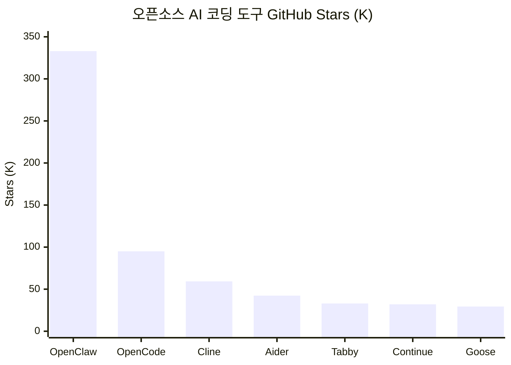

| | OpenClaw | OpenCode | Cline | Aider | Tabby | Continue | Goose |
|---|---|---|---|---|---|---|---|
| **Stars** | **333K** | 95K+ | 59.3K | 42.3K | 33K | 32K | 29.4K |
| **라이선스** | MIT | OSS | Apache 2.0 | Apache 2.0 | — | Apache 2.0 | Apache 2.0 |
| **유형** | 범용 AI | 터미널 에이전트 | VS Code 에이전트 | CLI 에이전트 | 코드 완성 | IDE+CI | 자율 에이전트 |
| **모델** | 다중 | 75+ | 다중+Ollama | **모든 LLM** | 로컬 전용 | 모든 모델 | 모든 LLM |
| **킬러 피처** | 50+ 메신저, 5400 Skills | TUI, LSP, 세션 공유 | 5M+ 설치 | Git-first | 코드 외부 전송 0% | CI/CD 통합 | Block 제작, MCP |

---

## 바이브코더 가격 레이더

| 구간 | 도구 | 가격 | 포함 내용 |
|---|---|---|---|
| **무료** | [Gemini CLI](https://github.com/google-gemini/gemini-cli) | $0 | 1,000 req/일 |
| | [Aider](https://aider.chat) | $0 | API 비용만 |
| | [GitHub Copilot](https://github.com/features/copilot) | $0 | 2,000 완성 + 50 프리미엄/월 |
| | [Trae](https://www.trae.ai) | $0 | $3 상당 + 5,000 자동완성 |
| | [Antigravity](https://antigravity.google) | $0 | 프리뷰 무료 |
| **~$10** | [Trae Lite](https://www.trae.ai) | $3/월 | $5 상당 사용량 |
| | [GitHub Copilot Pro](https://github.com/features/copilot) | $10/월 | 무제한 자동완성 + 에이전트 |
| | [Trae Pro](https://www.trae.ai) | $10/월 | 무제한 자동완성 + $20 상당 |
| **$20** | [Claude Pro](https://claude.com) | $20/월 | Claude Code + Cowork 포함 |
| | [Cursor Pro](https://cursor.com) | $20/월 | 자동완성 + Cloud Agent |
| | [Windsurf Pro](https://windsurf.com) | $20/월 | Cascade + SWE-1.5 |
| | [Kiro Pro](https://kiro.dev) | $20/월 | 1,000 크레딧 |
| | [Devin Core](https://devin.ai) | $20/월 | ACU 기반 에이전트 |
| **$100+** | [Claude Max](https://claude.com) | $100~200/월 | 5x~20x Pro |
| | [Cursor Ultra](https://cursor.com) | $200/월 | 20x 사용량 |
| | [Windsurf Max](https://windsurf.com) | $200/월 | 대용량 할당 |

### 바이브코더 커뮤니티 반응 (비교 중심)

> *"Cursor는 이미 아는 걸 더 빠르게 해준다. 가속기다. Claude Code는 대신 해준다. 위임자다."* — Builder.io `2026.01`

> *"$20 Plus 플랜으로 하루종일 코딩해도 한도에 걸린 적 없다."* — Reddit u/LaCaipirinha `2026.01`

> *"한 번 복잡한 프롬프트 날리면 5시간 한도의 50~70%가 날아간다."* — r/ClaudeAI (388 upvotes) `2026.02`

| 매치업 | 승자 (상황별) |
|---|---|
| **Claude Code vs Codex CLI** | 계획 따르기/디버깅 = Claude Code, 한도 없이 = Codex CLI |
| **Claude Code vs Cursor** | 인라인 편집 = Cursor, 자율 멀티파일 = Claude Code |
| **Cursor vs Windsurf** | 대규모 코드베이스 = Windsurf, 리팩토링 = Cursor |
| **Cursor vs Antigravity** | 안전성/프로덕션 = Cursor, 자율 실행 = Antigravity |
| **Windsurf vs Antigravity** | 모델 일관성 = Windsurf, 무료 = Antigravity |
| **Gemini CLI vs Claude Code** | 품질/속도 = Claude Code, 무료 = Gemini CLI |
| **GitHub Copilot vs Cursor** | VSCode 일상 = Copilot, 대규모 에이전트 = Cursor |
| **Trae vs Cursor** | 무료 프로토타입 = Trae, 프로덕션 = Cursor |
| **Bolt vs Lovable vs v0** | UI = v0, 풀스택 = Bolt, 논코더 = Lovable |

### 바이브코더 한 줄 평

| 도구 | 한마디 |
|---|---|
| **Cursor** | *"최고의 AI 에디터"* |
| **Claude Code** | *"최고의 AI 엔지니어"* |
| **Windsurf** | *"최고의 가성비"* |
| **Codex CLI** | *"가장 안전한 실행기"* |
| **Gemini CLI** | *"무료의 왕"* |
| **Antigravity** | *"$24억짜리 베이트 앤 스위치"* |
| **Trae** | *"공짜 치곤 너무 좋은데... 대가가 뭐지?"* |
| **Aider** | *"자유의 상징"* |

### 바이브코더 추천 스택

```
시니어 바이브코더 = Cursor (일상) + Claude Code (아키텍처) = $40/월
가성비 바이브코더 = Windsurf + Gemini CLI              = $20/월
오픈소스 매니아  = Aider + Ollama                     = $0/월
스타트업 MVP    = Lovable or Bolt.new                = $25/월
기업 보안팀     = Tabnine + Amazon Q                  = $58/user/월
```

### 바이브코더 인기도 트렌드

<!-- POPULARITY_CHART_START -->
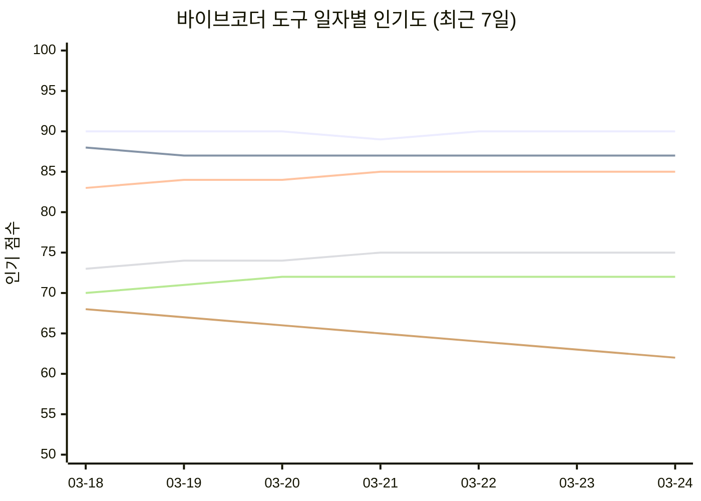
<!-- POPULARITY_CHART_END -->

<p align="center">
  
  
  
  
  
  
</p>


---

---

# 크리에이터

> 이미지와 비디오를 만드는 크리에이터를 위한 AI 도구들.

<p align="center">
  <a href="https://www.midjourney.com"></a>
  <a href="https://openai.com"></a>
  <a href="https://stability.ai"></a>
  <a href="https://ideogram.ai"></a>
  <a href="https://bfl.ai"></a>
  <a href="https://firefly.adobe.com"></a>
  <a href="https://ai.google.dev"></a>
  <a href="https://openai.com/sora"></a>
  <a href="https://runwayml.com"></a>
  <a href="https://klingai.com"></a>
  <a href="https://deepmind.google/technologies/veo"></a>
  <a href="https://pika.art"></a>
  <a href="https://lumalabs.ai"></a>
  <a href="https://hailuoai.video"></a>
</p>

### 크리에이터 진화 타임라인

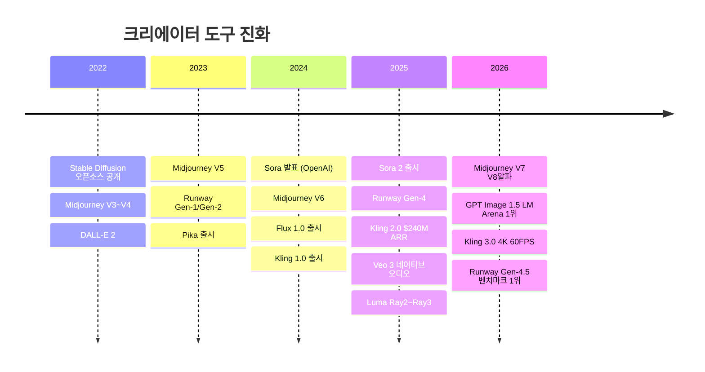

### 나한테 맞는 크리에이터 도구는?

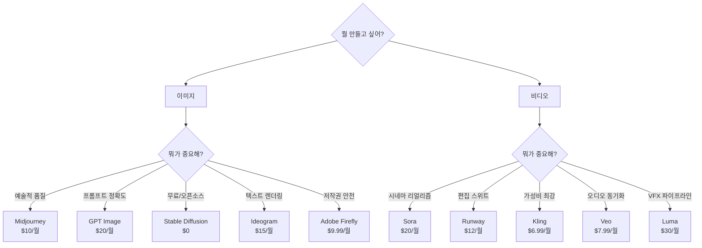

### 크리에이터 인기 순위

| 순위 | 이미지 도구 | 근거 | | 순위 | 비디오 도구 | 근거 |
|:---:|---|---|---|:---:|---|---|
| 1 | **[Midjourney](https://www.midjourney.com)** | 예술적 품질 최강, V8 알파 | | 1 | **[Runway](https://runwayml.com)** | Gen-4.5, 풀 편집 스위트 |
| 2 | **[GPT Image](https://openai.com)** | LM Arena 1위, 프롬프트 정확도 | | 2 | **[Sora](https://openai.com/sora)** | Sora 2, 시네마 리얼리즘 |
| 3 | **[Flux](https://bfl.ai)** | LM Arena 2위, 오픈소스 | | 3 | **[Kling](https://klingai.com)** | 3.0, $6.99 가성비, 4K 60FPS |
| 4 | **[Ideogram](https://ideogram.ai)** | 텍스트 렌더링 1위 | | 4 | **[Veo](https://deepmind.google)** | 3.1, 네이티브 오디오 |
| 5 | **[Adobe Firefly](https://firefly.adobe.com)** | 저작권 안전 | | 5 | **[Luma](https://lumalabs.ai)** | Ray3.14, 4K EXR |

### 크리에이터 전체 지도

```
크리에이터
├── AI 이미지 생성
│   ├── Midjourney ······ 예술적 품질 최강, $10/월~
│   ├── GPT Image ······· 프롬프트 정확도 1위, $20/월~
│   ├── Stable Diffusion · 오픈소스, 무료 셀프호스팅
│   ├── Ideogram ········ 텍스트 렌더링 최강, $15/월~
│   ├── Flux ············ 포토리얼리즘, $0.04/장
│   ├── Adobe Firefly ··· 저작권 안전, $9.99/월~
│   └── Google Imagen ··· Google 생태계, 무료(AI Studio)
│
└── AI 비디오 생성
    ├── Sora ············ 시네마 리얼리즘, $20/월~
    ├── Runway ··········· 풀 편집 스위트, $12/월~
    ├── Kling ············ 인간 리얼리즘 + 가성비, $6.99/월~
    ├── Veo ·············· 네이티브 오디오, $7.99/월~
    ├── Pika ············· 물리 효과 프리셋, $10/월~
    ├── Luma ············· VFX 파이프라인, $30/월~
    └── HailuoAI ········· 대량 생산 가성비, $14.99/월~
```

---

## AI 이미지 생성

> 텍스트로 이미지를 만든다. 디자이너 없이도 프로급 비주얼.

| | Midjourney | GPT Image | Stable Diffusion | Ideogram | Flux | Adobe Firefly | Google Imagen |
|---|---|---|---|---|---|---|---|
| **사이트** | [midjourney.com](https://www.midjourney.com) | [openai.com](https://openai.com) | [stability.ai](https://stability.ai) | [ideogram.ai](https://ideogram.ai) | [bfl.ai](https://bfl.ai) | [firefly.adobe.com](https://firefly.adobe.com) | [ai.google.dev](https://ai.google.dev) |
| **최신 모델** | V7 (V8 알파) | GPT Image 1.5 | SD 3.5 Large | Ideogram 3.0 | FLUX.1.1 Pro | Firefly 2026 | Imagen 4 Ultra |
| **무료** | X | ChatGPT 포함 | **O (자체 호스팅)** | O (제한) | O (Schnell, Apache 2.0) | X | **O (AI Studio)** |
| **시작가** | $10/월 | $20/월 (Plus) | $0 (셀프호스팅) | $15/월 | $0.04/장 | $9.99/월 | $0.02/장 |
| **킬러 피처** | 예술적 품질 최강 | 프롬프트 정확도 1위 | 오픈소스, 커스텀 학습 | **텍스트 렌더링 최강** | 포토리얼리즘 | 저작권 안전, Adobe 통합 | Google 생태계, SynthID |
| **대상** | 크리에이터, 아티스트 | ChatGPT 사용자 | 기술 사용자, 커스텀 | 디자이너, 타이포그래피 | 바이브코더, API | 기업, 브랜드 | Google 사용자 |

---

## AI 비디오 생성

> 텍스트/이미지로 영상을 만든다. 2026년 가장 빠르게 성장하는 AI 카테고리.

| | Sora | Runway | Kling | Veo | Pika | Luma | HailuoAI |
|---|---|---|---|---|---|---|---|
| **사이트** | [openai.com/sora](https://openai.com/sora) | [runwayml.com](https://runwayml.com) | [klingai.com](https://klingai.com) | [deepmind.google](https://deepmind.google/technologies/veo) | [pika.art](https://pika.art) | [lumalabs.ai](https://lumalabs.ai) | [hailuoai.video](https://hailuoai.video) |
| **최신 모델** | Sora 2 | Gen-4.5 | Kling 3.0 | Veo 3.1 | Pika 2.5 | Ray3.14 | Hailuo 2.3 |
| **무료** | X | O (125 크레딧) | **O (66 크레딧/일)** | O ($7.99) | O (80/월) | O (제한) | X |
| **시작가** | $20/월 (Plus) | **$12/월** | **$6.99/월** | $7.99/월 | **$10/월** | $30/월 | $14.99/월 |
| **해상도** | — | 4K | **4K, 60FPS** | 1080p | — | **4K EXR** | — |
| **오디오** | O | X | **O (동기화)** | **O (네이티브)** | O (자동) | X | X |
| **킬러 피처** | 시네마 리얼리즘 | 풀 편집 스위트 | 인간 리얼리즘 최강 | 오디오-비디오 동기화 | 물리 효과 프리셋 | VFX 파이프라인, ACES | 가성비 최강 |
| **대상** | 영상 제작자 | 프로 크리에이터 | 바이브코더, 예산 | Google 사용자 | 소셜 크리에이터 | VFX 아티스트 | 대량 생산 |


### 커뮤니티 반응: 이미지/비디오 AI

> *"Midjourney는 여전히 예술적 품질의 왕. DALL-E는 정확도의 왕. Stable Diffusion은 자유의 왕."*

> *"Kling 3.0이 $6.99에 이 퀄리티를 주는 게 말이 되나? Sora는 $20인데."* `2026.02`

> *"Runway Gen-4.5는 도구가 아니라 스튜디오다. 생성만 하는 다른 도구와 차원이 다르다."* `2026.03`

> *"Veo 3.1의 네이티브 오디오 동기화는 게임 체인저. 별도 음향 작업이 필요 없다."* `2026.03`


## 크리에이터 오픈소스

> 무료. 내 모델. 내 서버. 내 데이터. 자유의 땅.

| | Stable Diffusion | ComfyUI | Flux Schnell |
|---|---|---|---|
| **Stars** | — | 70K+ | — |
| **라이선스** | Community | GPL 3.0 | Apache 2.0 |
| **유형** | 이미지 생성 | 워크플로우 UI | 이미지 생성 |
| **킬러 피처** | 완전 로컬, LoRA/ControlNet | 노드 기반 워크플로우 | 상용 무료 Apache 2.0 |

---

## 크리에이터 가격 레이더

| 구간 | 도구 | 가격 | 포함 내용 |
|---|---|---|---|
| **무료** | [Stable Diffusion](https://stability.ai) | $0 | 셀프호스팅 |
| | [Google Imagen](https://ai.google.dev) | $0 | AI Studio |
| | [Kling](https://klingai.com) | $0 | 66 크레딧/일 |
| | [Pika](https://pika.art) | $0 | 80/월 |
| **~$10** | [Adobe Firefly](https://firefly.adobe.com) | $9.99/월 | 2,000 크레딧 |
| | [Midjourney](https://www.midjourney.com) | $10/월 | ~3.3 GPU시간 |
| | [Pika Standard](https://pika.art) | $10/월 | 700 크레딧 |
| **~$20** | [Runway Standard](https://runwayml.com) | $12/월 | 625 크레딧 |
| | [HailuoAI](https://hailuoai.video) | $14.99/월 | 1,000 크레딧 |
| | [Ideogram Plus](https://ideogram.ai) | $15/월 | — |
| | [Sora](https://openai.com/sora) | $20/월 | ChatGPT Plus |
| **$30+** | [Luma](https://lumalabs.ai) | $30/월 | Ray3.14 |
| | [Midjourney Pro](https://www.midjourney.com) | $60/월 | ~30 GPU시간 |

### 크리에이터 커뮤니티 반응

> *"Midjourney는 여전히 예술적 품질의 왕. DALL-E는 정확도의 왕. Stable Diffusion은 자유의 왕."*

> *"Kling 3.0이 $6.99에 이 퀄리티를 주는 게 말이 되나? Sora는 $20인데."* `2026.02`

> *"Runway Gen-4.5는 도구가 아니라 스튜디오다. 생성만 하는 다른 도구와 차원이 다르다."* `2026.03`

> *"Veo 3.1의 네이티브 오디오 동기화는 게임 체인저. 별도 음향 작업이 필요 없다."* `2026.03`

### 크리에이터 한 줄 평

| 도구 | 한마디 |
|---|---|
| **Midjourney** | *"예술적 품질의 왕"* |
| **GPT Image** | *"프롬프트 정확도 1위"* |
| **Stable Diffusion** | *"자유의 왕 (오픈소스)"* |
| **Ideogram** | *"텍스트 넣으면 이거"* |
| **Sora** | *"시네마 리얼리즘"* |
| **Runway** | *"도구가 아니라 스튜디오"* |
| **Kling** | *"$6.99의 기적"* |
| **Veo** | *"오디오까지 한 방에"* |

### 크리에이터 추천 스택

```
포스터 디자인   = Midjourney + Ideogram        = $25/월
숏폼 영상      = Kling + Pika                 = $17/월~
영화급 제작    = Runway + Luma                = $42/월
오픈소스 매니아 = Stable Diffusion + ComfyUI   = $0/월
```


---

---

# 일반사무

> 질문하고, 검색하고, 문서 정리하고, 업무를 자동화하는 오피스 워커를 위한 AI 도구들.

<p align="center">
  <a href="https://chatgpt.com"></a>
  <a href="https://claude.com"></a>
  <a href="https://gemini.google.com"></a>
  <a href="https://www.microsoft.com/en-us/microsoft-365-copilot"></a>
  <a href="https://x.ai"></a>
  <a href="https://www.perplexity.ai"></a>
  <a href="https://claude.com"></a>
  <a href="https://devin.ai"></a>
</p>

### 일반사무 진화 타임라인

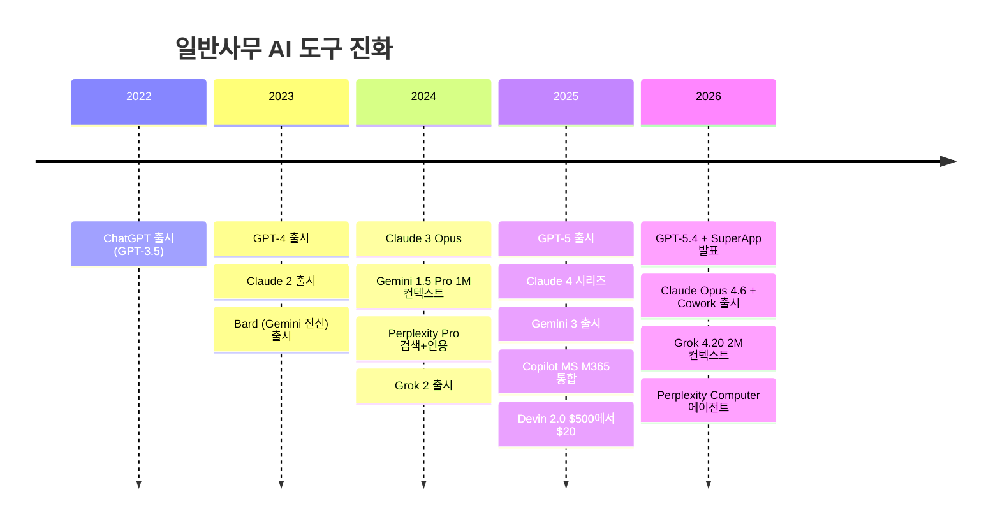

### 나한테 맞는 일반사무 도구는?

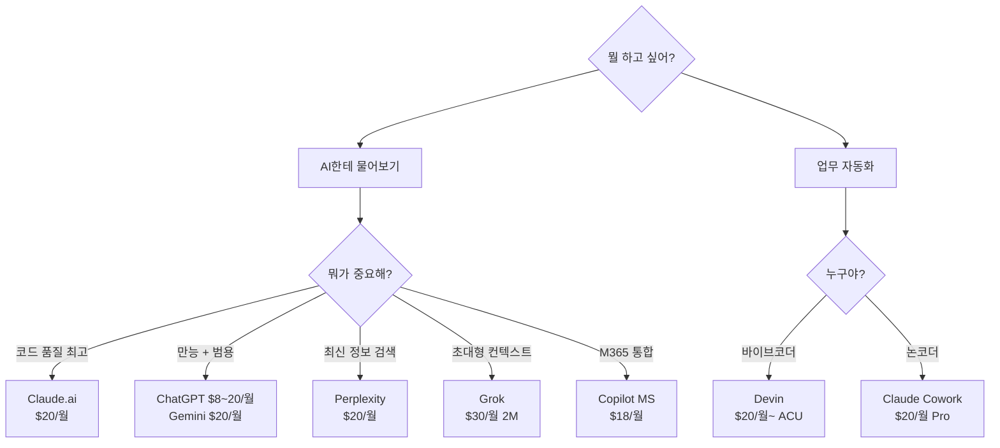

### 일반사무 인기 순위

| 순위 | 도구 | 근거 |
|:---:|---|---|
| 1 | **[ChatGPT](https://chatgpt.com)** | 주간 9억 사용자, 유료 5천만 명, SuperApp 발표 |
| 2 | **[Claude.ai](https://claude.com)** | 1M 컨텍스트, Extended Thinking, 코딩 품질 1위 |
| 3 | **[Gemini](https://gemini.google.com)** | 시장 점유율 5.4%→18.2% 급성장, 영상/이미지 생성 |
| 4 | **[Perplexity](https://www.perplexity.ai)** | 검색+인용 통합의 유일무이, Computer 에이전트 |
| 5 | **[Grok](https://x.ai)** | 2M 컨텍스트 (업계 최대), X 실시간 데이터 |

### 일반사무 전체 지도

```
일반사무
├── 채팅 AI
│   ├── ChatGPT ········· OpenAI, GPT-5.4, $0~200/월
│   ├── Claude.ai ······· Anthropic, Opus 4.6, $0~200/월
│   ├── Gemini ·········· Google, 3.1 Pro, $0~250/월
│   ├── Copilot (MS) ···· Microsoft, M365 통합, $0~30/월
│   ├── Grok ············ xAI, 2M 컨텍스트, $0~30/월
│   └── Perplexity ······ 검색+인용, $0~325/월
│
└── 자율 에이전트
    ├── Claude Cowork ··· 논코더 업무, $20/월~
    └── Devin ··········· 자율 코딩, $20/월~
```

---

## 채팅 AI

> 웹/앱에서 대화하며 질문, 코드 생성, 디버깅. 가장 접근성 높은 AI 도구.

| | ChatGPT | Claude.ai | Gemini | Copilot (MS) | Grok | Perplexity |
|---|---|---|---|---|---|---|
| **제공사** | OpenAI | Anthropic | Google | Microsoft | xAI | Perplexity AI |
| **사이트** | [chatgpt.com](https://chatgpt.com) | [claude.com](https://claude.com) | [gemini.google.com](https://gemini.google.com) | [microsoft.com](https://www.microsoft.com/en-us/microsoft-365-copilot) | [x.ai](https://x.ai) | [perplexity.ai](https://www.perplexity.ai) |
| **최신 모델** | GPT-5.4 | Claude Opus 4.6 | Gemini 3.1 Pro | GPT-5.4 + Claude | Grok 4.20 | Sonar Pro |
| **무료** | O | O | O | O | O | O |
| **시작가** | $8/월 (Go) | $20/월 (Pro) | $19.99/월 | $18/월 | $30/월 | $20/월 |
| **최고가** | $200/월 (Pro) | $200/월 (Max) | $249.99/월 (Ultra) | $30/월 | $30/월 | $325/seat/월 |
| **컨텍스트** | 128K | **1M** | 1M | — | **2M** | 모델별 |
| **킬러 피처** | Canvas + Codex | Extended Thinking | 영상/이미지 생성 | M365 통합 | X 실시간 데이터 | 검색+인용 |

> *"ChatGPT는 만능 스위스 나이프, Claude는 장인의 메스, Gemini는 Google 생태계의 열쇠"*

---

## 자율 에이전트

> "이거 해줘" 하면 알아서 연구, 계획, 실행, 검증까지. 가장 미래적인 카테고리.

| | Claude Cowork | Devin |
|---|---|---|
| **사이트** | [claude.com](https://claude.com) | [devin.ai](https://devin.ai) |
| **대상** | 논코더 오피스 워커 | 소프트웨어 엔지니어 |
| **환경** | 데스크톱 앱 | 클라우드 IDE |
| **시작가** | $20/월 (Pro) | $20/월 (Core, ACU별 과금) |
| **연동** | Drive, Gmail, Slack, DocuSign | GitHub, 자체 IDE |
| **과금** | 구독 | ACU ($2.25/unit, ~15분) |


### 커뮤니티 반응: 자율 에이전트

**Claude Cowork:**
> *"정리해달라고 했더니 '쓸모없다'고 판단한 파일 11GB를 삭제했다."* — 실사용자 경험담

> *"AI 경험 제로인 주니어가 45분 만에 쓸 줄 알게 되고, 이틀 차에 복잡한 작업을 위임하고 있었다."* — Hackceleration 6주 테스트

**Devin:**
> *"$500/월 Team은 잘 정의된 대량 백로그가 있어야만 가치가 있다. 모호한 작업은 Claude Code $20/월이 이긴다."* — Reddit 컨센서스


## 일반사무 오픈소스

> 무료. 내 모델. 내 서버. 내 데이터. 자유의 땅.

| | OpenClaw | LM Studio | Jan.ai |
|---|---|---|---|
| **Stars** | 333K | — | 25K+ |
| **라이선스** | MIT | 무료 (비오픈소스) | AGPL 3.0 |
| **유형** | 범용 AI 어시스턴트 | 로컬 LLM 실행기 | 로컬 AI 채팅 |
| **킬러 피처** | 50+ 메신저 통합 | GPU 자동감지, 원클릭 | 오프라인 완전 지원 |

---

## 일반사무 가격 레이더

| 구간 | 도구 | 가격 | 포함 내용 |
|---|---|---|---|
| **무료** | [ChatGPT](https://chatgpt.com) | $0 | GPT-5 mini |
| | [Claude.ai](https://claude.com) | $0 | Sonnet 4.5 |
| | [Gemini](https://gemini.google.com) | $0 | 100 AI 크레딧 |
| | [Perplexity](https://www.perplexity.ai) | $0 | 제한적 |
| **~$20** | [ChatGPT Go](https://chatgpt.com) | $8/월 | GPT-5.3 Instant |
| | [Copilot MS](https://www.microsoft.com/en-us/microsoft-365-copilot) | $18/월 | M365 통합 |
| | [ChatGPT Plus](https://chatgpt.com) | $20/월 | GPT-5.2 + Codex |
| | [Claude Pro](https://claude.com) | $20/월 | Opus 4.6 + Cowork |
| | [Gemini Pro](https://gemini.google.com) | $19.99/월 | Gemini 3 |
| | [Perplexity Pro](https://www.perplexity.ai) | $20/월 | 무제한 Pro |
| | [Devin Core](https://devin.ai) | $20/월 | ACU 기반 |
| **$30+** | [Grok](https://x.ai) | $30/월 | 2M 컨텍스트 |
| | [ChatGPT Pro](https://chatgpt.com) | $200/월 | GPT-5.4 Pro |
| | [Claude Max](https://claude.com) | $100~200/월 | 5x~20x |
| | [Gemini Ultra](https://gemini.google.com) | $249.99/월 | 모든 기능 |

### 일반사무 커뮤니티 반응 (비교 중심)

> *"Claude가 Python에서 GPT4를 압도한다."* — r/programming `2026.01`

> *"어제 Claude로 갈아탔는데 폰 앱 전체를 만들어줬다. 내 말을 진짜 듣는 느낌이다."* — r/programming `2026.02`

> *"정리해달라고 했더니 '쓸모없다'고 판단한 파일 11GB를 삭제했다."* — Claude Cowork 사용자 `2026.01`

| 매치업 | 승자 (상황별) |
|---|---|
| **ChatGPT vs Claude (코딩)** | 코딩 품질 = Claude (78%), 범용 = ChatGPT |
| **Devin vs Claude Code** | 자율 위임 = Devin, 대화형 디버깅 = Claude Code |

### 일반사무 한 줄 평

| 도구 | 한마디 |
|---|---|
| **ChatGPT** | *"만능 스위스 나이프"* |
| **Claude.ai** | *"장인의 메스"* |
| **Gemini** | *"Google 생태계의 열쇠"* |
| **Perplexity** | *"검색+인용의 유일무이"* |
| **Grok** | *"2M 컨텍스트의 괴물"* |
| **Devin** | *"비싸지만 진짜 자율"* |
| **Claude Cowork** | *"논코더의 Claude Code"* |

### 일반사무 추천 스택

```
오피스워커   = ChatGPT + Claude Cowork         = $40/월
리서처      = Perplexity + Grok               = $50/월
M365 사용자 = Copilot MS                      = $18/월
```


---

## 기여하기

AI 도구 시장은 매주 바뀝니다. 정보가 오래됐거나 새 도구가 나왔다면:

- **[PR 보내기](https://github.com/tykimos/ai-whatchelin/pulls)** — 가격 업데이트, 새 도구 추가, 오류 수정
- **[Issue 열기](https://github.com/tykimos/ai-whatchelin/issues)** — "이거 틀렸어요", "이 도구 빠졌어요"
- **Star 눌러주세요** — 더 많은 바이브코더에게 닿을 수 있게

---


### 팩트 체크 로그 (2026-03-24)

모든 가격 정보는 각 서비스의 공식 웹사이트에서 직접 검증했습니다.

| 도구 | 검증 URL | 주요 변경사항 |
|---|---|---|
| ChatGPT | chatgpt.com/pricing | Go 플랜 $8/월 신규 추가 |
| Claude | claude.com/pricing | Max 플랜 확인 ($100~$200/월) |
| Cursor | cursor.com/pricing | Pro+ $60/월 확인, Bugbot 별도 |
| Windsurf | windsurf.com/pricing | Max $200/월 확인 |
| Kiro | kiro.dev/pricing | 500 보너스 크레딧 (30일) |
| GitHub Copilot | github.com/features/copilot/plans | Pro Plus 신규, Enterprise에 Opus 4.6 |
| Devin | devin.ai/pricing | ACU 기반 과금 확인 |
| Bolt | bolt.new/pricing | 토큰 롤오버 2025.07부터 |
| v0 | v0.app/pricing | v0.dev -> v0.app 도메인 변경 |
| Lovable | lovable.dev/pricing | 학생 50% 할인, Q1 Cloud $25 포함 |
| Tabnine | tabnine.com/pricing | 연간 구독만, 무료 폐지 |
| Sourcegraph | sourcegraph.com | Cody Free/Pro 2025.07 폐지, Amp 전환 |
| Trae | docs.trae.ai | 5단계: Free/$3/$10/$30/$100 |
| Antigravity | antigravity.google | Google AI Pro/Ultra 구독의 일부 |


---

## Star History

<p align="center">
  <a href="https://star-history.com/#tykimos/ai-whatchelin&Date">
    <picture>
      <source media="(prefers-color-scheme: dark)" srcset="https://api.star-history.com/svg?repos=tykimos/ai-whatchelin&type=Date&theme=dark&v=20260325">
      
    </picture>
  </a>
</p>

---

## Activity

<p align="center">
  
  
  
  
  
</p>

---

## 2026 업체별 주요 발표 타임라인

> 2026년 AI 업체들의 굵직한 발표를 날짜순으로 정리. 모두 공식 소스 팩트체크 완료.

### Anthropic (Claude)

> 2026년 Anthropic이 발표한 것들. 그냥 미쳤음.

| 날짜 | 발표 내용 | 출처 |
|---|---|---|
| 2026/03/24 | Claude Code Auto Mode (자동 퍼미션 판단) | [techcrunch.com](https://techcrunch.com/2026/03/24/anthropic-hands-claude-code-more-control-but-keeps-it-on-a-leash/) |
| 2026/03/23 | **Claude Computer Use** (마우스/키보드 제어) | [engadget.com](https://www.engadget.com/ai/claude-code-and-cowork-can-now-use-your-computer-210000126.html) |
| 2026/03/20 | Cowork에 Projects 도입 + Claude Code Channels (Discord/Telegram) | [venturebeat.com](https://venturebeat.com/orchestration/anthropic-just-shipped-an-openclaw-killer-called-claude-code-channels) |
| 2026/03/17 | Dispatch (Cowork 원격 제어, 영속 에이전트 스레드) | [mlq.ai](https://mlq.ai/news/anthropic-launches-claude-dispatch-for-remote-desktop-ai-control/) |
| 2026/03/13 | **1M 토큰 컨텍스트 윈도우 GA** (추가 비용 없음) | [claude.com](https://claude.com/blog/1m-context-ga) |
| 2026/03/12 | 채팅 내 차트·다이어그램 시각화 + $1억 파트너 네트워크 | [anthropic.com](https://www.anthropic.com/news/claude-partner-network) |
| 2026/03/11 | Excel & PowerPoint 크로스앱 업데이트 + Anthropic Institute | [anthropic.com](https://www.anthropic.com/news/the-anthropic-institute) |
| 2026/03/09 | Claude Code Review (멀티에이전트 PR 리뷰) | [techcrunch.com](https://techcrunch.com/2026/03/09/anthropic-launches-code-review-tool-to-check-flood-of-ai-generated-code/) |
| 2026/03/07 | Claude Community Ambassadors 프로그램 시작 | [claude.com](https://claude.com/community/ambassadors) |
| 2026/03/06 | Claude Marketplace + Mozilla Firefox 보안 파트너십 | [siliconangle.com](https://siliconangle.com/2026/03/06/anthropic-launches-claude-marketplace-third-party-cloud-services/) |
| 2026/03/02 | Claude Memory (무료 사용자 확대) + ChatGPT 히스토리 임포트 | [engadget.com](https://www.engadget.com/ai/anthropic-brings-memory-to-claudes-free-plan-220729070.html) |
| 2026/02/25 | Claude Code Remote Control + Cowork 예약 작업 + Vercept 인수 | [venturebeat.com](https://venturebeat.com/orchestration/anthropic-just-released-a-mobile-version-of-claude-code-called-remote) |
| 2026/02/24 | Cowork Enterprise + 플러그인 마켓플레이스 | [techcrunch.com](https://techcrunch.com/2026/02/24/anthropic-launches-new-push-for-enterprise-agents-with-plugins-for-finance-engineering-and-design/) |
| 2026/02/20 | Claude Code Security (500+ 취약점 발견) | [anthropic.com](https://www.anthropic.com/news/claude-code-security) |
| 2026/02/17 | **Sonnet 4.6** | [anthropic.com](https://www.anthropic.com/news/claude-sonnet-4-6) |
| 2026/02/12 | **$300억 Series G** ($3,800억 밸류에이션) | [anthropic.com](https://www.anthropic.com/news/anthropic-raises-30-billion-series-g-funding-380-billion-post-money-valuation) |
| 2026/02/10 | Cowork 윈도우 공개 | [venturebeat.com](https://venturebeat.com/technology/anthropics-claude-cowork-finally-lands-on-windows-and-it-wants-to-automate) |
| 2026/02/07 | Fast Mode (Opus 4.6 2.5배 빠른 출력) | [platform.claude.com](https://platform.claude.com/docs/en/release-notes/overview) |
| 2026/02/05 | **Opus 4.6** + Claude in PowerPoint + Excel 업데이트 + Compaction API | [anthropic.com](https://www.anthropic.com/news/claude-opus-4-6) |
| 2026/01/30 | Cowork 플러그인 (11개 오픈소스) | [siliconangle.com](https://siliconangle.com/2026/01/30/anthropic-debuts-claude-cowork-plugins-help-users-automate-tasks/) |
| 2026/01/22 | Claude 새 헌법 (모델 스펙 업데이트) | [anthropic.com](https://www.anthropic.com/news/claude-new-constitution) |
| 2026/01/13 | Anthropic Labs (연구 인큐베이터) | [anthropic.com](https://www.anthropic.com/news/introducing-anthropic-labs) |
| 2026/01/12 | Claude Cowork (맥용 리서치 프리뷰) | [anthropic.com](https://www.anthropic.com/news) |

### OpenAI

| 날짜 | 발표 내용 | 출처 |
|---|---|---|
| 2026/03/24 | **Sora 셧다운** (앱 + API 종료, 로보틱스로 전환) | [axios.com](https://www.axios.com/2026/03/24/openai-discontinue-sora-video-app) |
| 2026/03/20 | Codex for Students ($100 크레딧) | [help.openai.com](https://help.openai.com/en/articles/6825453-chatgpt-release-notes) |
| 2026/03/20 | **SuperApp 발표** (ChatGPT + Codex + Atlas 브라우저 통합) | [bloomberg.com](https://www.bloomberg.com/news/articles/2026-03-20/openai-plans-desktop-app-combining-chat-coding-and-web-browsing) |
| 2026/03/18 | GPT-5.4 mini 롤아웃 | [help.openai.com](https://help.openai.com/en/articles/9624314-model-release-notes) |
| 2026/03/17 | 모델 피커 간소화 (Instant/Thinking/Pro) | [help.openai.com](https://help.openai.com/en/articles/6825453-chatgpt-release-notes) |
| 2026/03/05 | **GPT-5.4** (Thinking + Pro, 컴퓨터 제어, 1M 컨텍스트) | [openai.com](https://openai.com/index/introducing-gpt-5-4/) |
| 2026/03/03 | GPT-5.3 Instant ("크린지" 줄임) | [openai.com](https://openai.com/index/gpt-5-3-instant/) |
| 2026/02/12 | GPT-5.3-Codex-Spark (1,000+ tok/s, Cerebras) | [openai.com](https://openai.com/index/introducing-gpt-5-3-codex-spark/) |
| 2026/02/05 | **GPT-5.3-Codex** (25% 빠르게, 자기 부트스트랩) | [openai.com](https://openai.com/index/introducing-gpt-5-3-codex/) |
| 2026/01/16 | **ChatGPT Go** ($8/월, 170+ 국가) | [openai.com](https://openai.com/index/introducing-chatgpt-go/) |
| 2026/01/14 | GPT-5.2-Codex (에이전틱 코딩) | [openai.com](https://openai.com/index/introducing-gpt-5-2-codex/) |

### Google (DeepMind)

| 날짜 | 발표 내용 | 출처 |
|---|---|---|
| 2026/03/17 | **Gemini 3 Flash** (새 기본 모델) | [blog.google](https://blog.google/products/gemini/gemini-3-flash/) |
| 2026/03/11 | Gemini CLI Plan Mode GA + **Antigravity 쿼터 논란** | [developers.googleblog.com](https://developers.googleblog.com/plan-mode-now-available-in-gemini-cli/) |
| 2026/03/03 | **Gemini 3.1 Flash-Lite** (Pro의 1/8 비용) | [blog.google](https://blog.google/innovation-and-ai/models-and-research/gemini-models/gemini-3-1-flash-lite/) |
| 2026/02/19 | **Gemini 3.1 Pro** | [deepmind.google](https://deepmind.google/models/model-cards/gemini-3-1-pro/) |
| 2026/02/17 | **Imagen 4** 패밀리 GA + Imagen 4 Fast | [developers.googleblog.com](https://developers.googleblog.com/announcing-imagen-4-fast-and-imagen-4-family-generally-available-in-the-gemini-api/) |
| 2026/02/12 | Gemini 3 Deep Think (과학/공학 특화) | [blog.google](https://blog.google/innovation-and-ai/models-and-research/gemini-models/gemini-3-deep-think/) |
| 2026/01/27 | Google AI Plus ($7.99/월) 35개국 확대 | [blog.google](https://blog.google/products-and-platforms/products/google-one/google-ai-plus-availability/) |
| 2026/01/13 | Veo 3.1 업데이트 (세로 영상, 4K, 오디오) | [blog.google](https://blog.google/innovation-and-ai/technology/ai/veo-3-1-ingredients-to-video/) |
| 2026/01/05 | Boston Dynamics + DeepMind 로보틱스 파트너십 | [bostondynamics.com](https://bostondynamics.com/blog/boston-dynamics-google-deepmind-form-new-ai-partnership/) |

### Microsoft

| 날짜 | 발표 내용 | 출처 |
|---|---|---|
| 2026/03/11 | GitHub Copilot JetBrains: 커스텀 에이전트, 서브에이전트, Plan Agent GA | [github.blog](https://github.blog/changelog/2026-03-11-major-agentic-capabilities-improvements-in-github-copilot-for-jetbrains-ides/) |
| 2026/03/09 | **Copilot Cowork** (Anthropic 협업) + **Agent 365** + **M365 E7** ($99/user/월) | [microsoft.com](https://www.microsoft.com/en-us/microsoft-365/blog/2026/03/09/powering-frontier-transformation-with-copilot-and-agents/) |
| 2026/02/~ | M365 Copilot: 스마트 스케줄링, 비주얼 리캡, OneDrive 에이전트 | [techcommunity.microsoft.com](https://techcommunity.microsoft.com/blog/microsoft365copilotblog/what%E2%80%99s-new-in-microsoft-365-copilot--february-2026/4496489) |
| 2026/01/~ | M365 Copilot: Excel 에이전트 모드, 음성 메모리, Outlook 모바일 | [techcommunity.microsoft.com](https://techcommunity.microsoft.com/blog/microsoft365copilotblog/what%E2%80%99s-new-in-microsoft-365-copilot--january-2026/4488916) |

### Cursor

| 날짜 | 발표 내용 | 출처 |
|---|---|---|
| 2026/03/19 | **Composer 2** 모델 (Kimi K2.5 기반) + **Cursor Glass** 알파 | [cursor.com](https://cursor.com/blog/composer-2) |
| 2026/03/12 | **$50B 밸류에이션** 협상 (Bloomberg) | [bloomberg.com](https://www.bloomberg.com/news/articles/2026-03-12/ai-coding-startup-cursor-in-talks-for-about-50-billion-valuation) |
| 2026/03/02 | **$2B ARR** 돌파 | [techcrunch.com](https://techcrunch.com/2026/03/02/cursor-has-reportedly-surpassed-2b-in-annualized-revenue/) |

### xAI (Grok)

| 날짜 | 발표 내용 | 출처 |
|---|---|---|
| 2026/03/10 | **Grok 4.20** (2M 컨텍스트, 멀티에이전트) | [docs.x.ai](https://docs.x.ai/developers/release-notes) |
| 2026/01/28 | Grok Imagine API (비디오 + 이미지 생성) | [x.ai](https://x.ai/news/grok-imagine-api) |

### Midjourney

| 날짜 | 발표 내용 | 출처 |
|---|---|---|
| 2026/03/17 | **V8 Alpha** (5배 빠름, 2K 네이티브, 텍스트 렌더링) | [updates.midjourney.com](https://updates.midjourney.com/v8-alpha/) |
| 2026/01/09 | Niji 7 (애니메 모델) | [updates.midjourney.com](https://updates.midjourney.com/niji-v7/) |

### Runway

| 날짜 | 발표 내용 | 출처 |
|---|---|---|
| 2025/12/01 | Gen-4.5 (현재 최상위 모델, Elo 1위) | [runwayml.com](https://runwayml.com/research/introducing-runway-gen-4.5) |

---

## Contributors

<p align="center">
  <a href="https://github.com/tykimos/ai-whatchelin/graphs/contributors">
    
  </a>
</p>

<p align="center">
  <em>기여해주신 모든 분들께 감사합니다!</em>
</p>

---

<p align="center">
  
  
  
  
</p>

<p align="center">
  <em>이 문서는 공식 사이트 팩트 체크 + 커뮤니티 실사용 반응을 기반으로 작성되었습니다.</em><br>
  <em>가격과 기능은 수시로 변경됩니다. 구독 전 반드시 공식 사이트를 확인하세요.</em>
</p>
